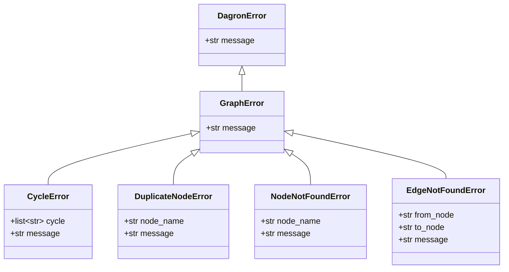

# Errors

All dagron exceptions inherit from `DagronError`, making it easy to catch any
library error with a single `except` clause. More specific exceptions allow
targeted handling of individual failure modes.

---

## Error Hierarchy



---

## DagronError

<ApiSignature name="DagronError" signature={`class DagronError(Exception):
    message: str`} />

The base exception for all dagron errors. Every exception raised by dagron is a
subclass of this class, so you can write a single catch-all handler:

```python
import dagron

try:
    dag = dagron.DAG()
    dag.add_edge("x", "y")  # nodes don't exist
except dagron.DagronError as e:
    print(f"dagron error: {e}")
```

| Attribute | Type | Description |
|-----------|------|-------------|
| `message` | `str` | Human-readable error description. |

---

## GraphError

<ApiSignature name="GraphError" signature={`class GraphError(DagronError):
    message: str`} />

Base class for all errors related to graph structure operations. Covers node
and edge manipulation, cycle detection, and structural invariant violations.

| Attribute | Type | Description |
|-----------|------|-------------|
| `message` | `str` | Human-readable error description. |

```python
try:
    dag.add_edge("nonexistent", "also_nonexistent")
except dagron.GraphError as e:
    # Catches NodeNotFoundError, EdgeNotFoundError, CycleError, etc.
    print(f"Graph error: {e}")
```

---

## CycleError

<ApiSignature name="CycleError" signature={`class CycleError(GraphError):
    cycle: list[str]
    message: str`} />

Raised when an operation would introduce a cycle into the DAG. The `cycle`
attribute contains the list of node names forming the cycle, which is invaluable
for debugging.

<ParamTable params={[
  {name: "cycle", type: "list[str]", description: "The node names forming the detected cycle, in order."},
  {name: "message", type: "str", description: "Human-readable error message including the cycle path."},
]} />

```python
import dagron

dag = dagron.DAG()
dag.add_node("a")
dag.add_node("b")
dag.add_node("c")
dag.add_edge("a", "b")
dag.add_edge("b", "c")

try:
    dag.add_edge("c", "a")  # would create a -> b -> c -> a
except dagron.CycleError as e:
    print(f"Cycle detected: {e.cycle}")
    # Cycle detected: ['a', 'b', 'c', 'a']
```

`CycleError` is also raised by `DAG.validate()` if the graph contains a cycle,
and by `DAGBuilder.build()` during construction.

---

## DuplicateNodeError

<ApiSignature name="DuplicateNodeError" signature={`class DuplicateNodeError(GraphError):
    node_name: str
    message: str`} />

Raised when attempting to add a node with a name that already exists in the
graph.

<ParamTable params={[
  {name: "node_name", type: "str", description: "The duplicate node name."},
  {name: "message", type: "str", description: "Human-readable error message."},
]} />

```python
dag = dagron.DAG()
dag.add_node("extract")

try:
    dag.add_node("extract")  # duplicate
except dagron.DuplicateNodeError as e:
    print(f"Duplicate: {e.node_name}")
    # Duplicate: extract
```

---

## NodeNotFoundError

<ApiSignature name="NodeNotFoundError" signature={`class NodeNotFoundError(GraphError):
    node_name: str
    message: str`} />

Raised when referencing a node that does not exist in the graph. Common triggers
include `add_edge()` with a non-existent endpoint, `remove_node()` on a missing
node, or `get_payload()` for an unknown name.

<ParamTable params={[
  {name: "node_name", type: "str", description: "The node name that was not found."},
  {name: "message", type: "str", description: "Human-readable error message."},
]} />

```python
dag = dagron.DAG()
dag.add_node("a")

try:
    dag.add_edge("a", "nonexistent")
except dagron.NodeNotFoundError as e:
    print(f"Missing node: {e.node_name}")
    # Missing node: nonexistent
```

---

## EdgeNotFoundError

<ApiSignature name="EdgeNotFoundError" signature={`class EdgeNotFoundError(GraphError):
    from_node: str
    to_node: str
    message: str`} />

Raised when referencing an edge that does not exist in the graph. Typically
triggered by `remove_edge()`.

<ParamTable params={[
  {name: "from_node", type: "str", description: "The source node of the missing edge."},
  {name: "to_node", type: "str", description: "The target node of the missing edge."},
  {name: "message", type: "str", description: "Human-readable error message."},
]} />

```python
dag = dagron.DAG()
dag.add_node("a")
dag.add_node("b")

try:
    dag.remove_edge("a", "b")  # edge doesn't exist
except dagron.EdgeNotFoundError as e:
    print(f"No edge from {e.from_node} to {e.to_node}")
    # No edge from a to b
```

---

## Error Handling Patterns

### Catch-all

Use `DagronError` as a catch-all for any dagron-specific error:

```python
try:
    dag = build_complex_pipeline()
    result = dagron.DAGExecutor(dag).execute(tasks)
except dagron.DagronError as e:
    logger.error(f"Pipeline failed: {e}")
    raise
```

### Granular handling

For more control, catch specific exceptions:

```python
try:
    dag = (
        dagron.DAG.builder()
        .add_node("a")
        .add_node("b")
        .add_edge("a", "b")
        .add_edge("b", "a")  # cycle
        .build()
    )
except dagron.CycleError as e:
    print(f"Fix the cycle: {' -> '.join(e.cycle)}")
except dagron.DuplicateNodeError as e:
    print(f"Remove duplicate node: {e.node_name}")
except dagron.NodeNotFoundError as e:
    print(f"Add missing node first: {e.node_name}")
```

### Checking before acting

Use predicate methods to avoid exceptions entirely:

```python
if dag.has_node("transform"):
    dag.remove_node("transform")

if dag.has_edge("a", "b"):
    dag.remove_edge("a", "b")
```

---

## Related

- [DAG](/api/core/core) — core graph class whose methods raise these errors.
- [DAGBuilder](/api/core/builder) — builder that raises `CycleError` on `.build()`.
- [Gates](/api/execution/gates) — `GateRejectedError` and `GateTimeoutError` for gate-specific errors.
