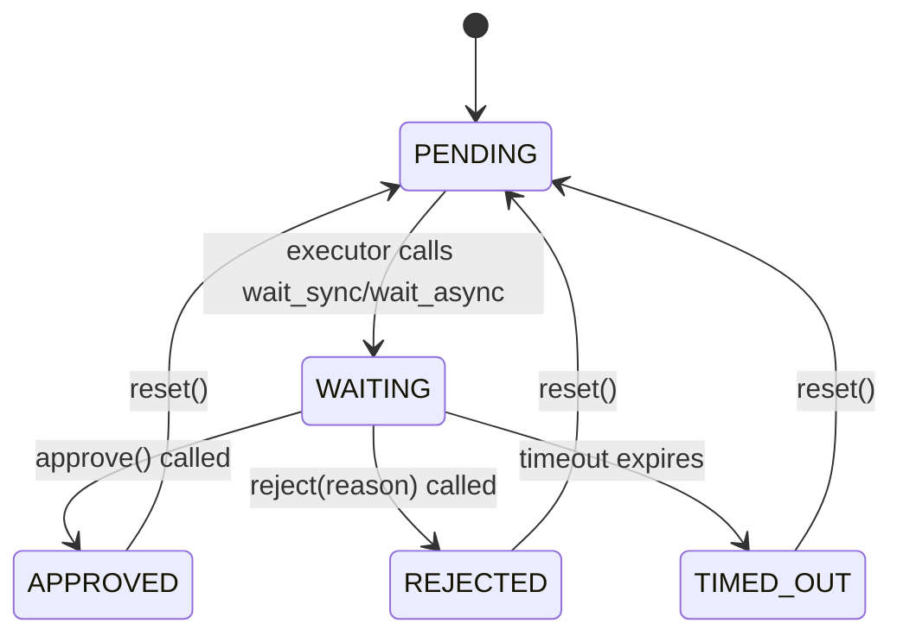

# Approval Gates

Production pipelines often need a human checkpoint before proceeding. dagron's **approval gates** let you pause execution at specific nodes until an operator explicitly approves or rejects the step. This is useful for deployment sign-offs, data quality reviews, compliance checks, and any workflow that requires human judgment.

Gates are **execution-time concerns**, not graph structure. The DAG itself stays pure; gates are attached via a `GateController` that the executor consults at runtime.

<DagDiagram
  chart={`graph TD
    build["build"]
    test["test"]
    gate_qa{{"QA Gate &#x23F8;"}}
    stage["stage"]
    gate_prod{{"Prod Gate &#x23F8;"}}
    deploy["deploy"]
    build --> test
    test --> gate_qa
    gate_qa --> stage
    stage --> gate_prod
    gate_prod --> deploy
    style gate_qa fill:#fff3e0,stroke:#e65100
    style gate_prod fill:#fff3e0,stroke:#e65100`}
  caption="A deployment pipeline with two approval gates. Execution pauses at each gate until a human approves."
/>

---

## Core Classes

| Class | Role |
|---|---|
| [`ApprovalGate`](/api/execution/gates#approvalgate) | A single gate that blocks until approved, rejected, or timed out. |
| [`GateController`](/api/execution/gates#gatecontroller) | Manages multiple named gates. Thread-safe facade for approve/reject operations. |
| [`GateStatus`](/api/execution/gates#gatestatus) | Enum: `PENDING`, `WAITING`, `APPROVED`, `REJECTED`, `TIMED_OUT`. |
| [`GateRejectedError`](/api/execution/gates#gaterejectederror) | Raised when a gate is rejected. |
| [`GateTimeoutError`](/api/execution/gates#gatetimeouterror) | Raised when a gate times out before a decision is made. |

---

## Creating Gates

### Single Gate

An `ApprovalGate` represents a single decision point:

```python
from dagron.execution.gates import ApprovalGate, GateStatus

gate = ApprovalGate(timeout=300)  # 5-minute timeout
print(gate.status)  # GateStatus.PENDING
```

### GateController

In practice you manage multiple gates through a `GateController`:

```python
from dagron.execution.gates import ApprovalGate, GateController

controller = GateController({
    "qa_review":    ApprovalGate(timeout=600),   # 10 min
    "prod_deploy":  ApprovalGate(timeout=300),   # 5 min
})
```

The controller provides a thread-safe interface for approving and rejecting gates by name.

---

## Gate Lifecycle

Each gate transitions through a well-defined set of states:



- **PENDING** -- initial state. The gate exists but no one is waiting on it yet.
- **WAITING** -- the executor has reached this gate and is blocked, waiting for a decision.
- **APPROVED** -- the gate was approved and execution continues.
- **REJECTED** -- the gate was rejected, which raises a `GateRejectedError` in the executor.
- **TIMED_OUT** -- the timeout expired before a decision, raising a `GateTimeoutError`.

---

## Approving and Rejecting

### From Another Thread

Gates are designed for multi-threaded use. The executor blocks on the gate in one thread, and you approve or reject from another:

```python
import threading
from dagron.execution.gates import ApprovalGate, GateController

controller = GateController({
    "deploy": ApprovalGate(timeout=120),
})

# In the executor thread, the gate blocks:
# controller.wait_sync("deploy")  # blocks until approve/reject

# From a monitoring thread, API handler, or CLI:
controller.approve("deploy")
# or:
controller.reject("deploy", reason="Failed canary analysis")
```

### Querying Status

```python
print(controller.status("deploy"))  # GateStatus.APPROVED

# List all gates currently waiting for a decision
waiting = controller.waiting_gates()
print(f"Gates awaiting approval: {waiting}")
```

---

## Integrating Gates with Execution

Gates are integrated into DAG execution via **callbacks**. The executor calls `controller.wait_sync(node_name)` when it reaches a node that has an associated gate. Here is a complete example:

```python
import threading
import time
import dagron
from dagron.execution.gates import ApprovalGate, GateController, GateStatus
from dagron.execution._types import ExecutionCallbacks

# 1. Build the DAG
dag = (
    dagron.DAG.builder()
    .add_node("build")
    .add_node("test")
    .add_node("review_gate")
    .add_node("deploy_staging")
    .add_node("deploy_gate")
    .add_node("deploy_prod")
    .add_edge("build", "test")
    .add_edge("test", "review_gate")
    .add_edge("review_gate", "deploy_staging")
    .add_edge("deploy_staging", "deploy_gate")
    .add_edge("deploy_gate", "deploy_prod")
    .build()
)

# 2. Set up gates
controller = GateController({
    "review_gate": ApprovalGate(timeout=600),
    "deploy_gate": ApprovalGate(timeout=300),
})

# 3. Create tasks that wait at gates
def make_gate_task(gate_name):
    """Create a task that blocks on a gate."""
    def task():
        print(f"  Waiting for approval at '{gate_name}'...")
        controller.wait_sync(gate_name)
        print(f"  Gate '{gate_name}' approved!")
        return "approved"
    return task

tasks = {
    "build":          lambda: print("  Building...") or "build-ok",
    "test":           lambda: print("  Testing...") or "test-ok",
    "review_gate":    make_gate_task("review_gate"),
    "deploy_staging": lambda: print("  Deploying to staging...") or "staging-ok",
    "deploy_gate":    make_gate_task("deploy_gate"),
    "deploy_prod":    lambda: print("  Deploying to production!") or "prod-ok",
}

# 4. Auto-approve from a background thread (simulates human operator)
def auto_approver():
    while True:
        time.sleep(1)
        for name in controller.waiting_gates():
            print(f"  [approver] Approving '{name}'")
            controller.approve(name)

approver = threading.Thread(target=auto_approver, daemon=True)
approver.start()

# 5. Execute
executor = dagron.DAGExecutor(dag)
result = executor.execute(tasks)
print(f"Completed: {result.succeeded} nodes")
```

---

## Handling Rejection

When a gate is rejected, `wait_sync()` raises a `GateRejectedError`. If the executor is running with `fail_fast=True` (the default), all downstream nodes are skipped:

```python
from dagron.execution.gates import GateRejectedError

try:
    controller.wait_sync("deploy_gate")
except GateRejectedError as e:
    print(f"Gate '{e.gate_name}' rejected: {e.reason}")
    # With fail_fast, deploy_prod will be skipped
```

<DagDiagram
  chart={`graph TD
    build["build &#x2705;"]
    test["test &#x2705;"]
    gate{{"deploy_gate &#x274C;"}}
    deploy["deploy &#x23ED;"]
    build --> test --> gate --> deploy
    style gate fill:#ffcdd2,stroke:#c62828
    style deploy fill:#e0e0e0,stroke:#9e9e9e`}
  caption="When the deploy_gate is rejected, downstream nodes are skipped."
/>

---

## Handling Timeouts

If no decision is made before the timeout expires, `GateTimeoutError` is raised:

```python
from dagron.execution.gates import ApprovalGate, GateTimeoutError

gate = ApprovalGate(timeout=5)  # 5-second timeout

try:
    gate.wait_sync()
except GateTimeoutError as e:
    print(f"Timed out after {e.timeout}s")
    print(f"Gate status: {gate.status}")  # GateStatus.TIMED_OUT
```

---

## Async Gates

Gates work seamlessly with async code:

```python
import asyncio
from dagron.execution.gates import ApprovalGate

gate = ApprovalGate(timeout=60)

async def wait_for_approval():
    print("Waiting for approval...")
    await gate.wait_async()
    print("Approved!")

async def approve_later():
    await asyncio.sleep(2)
    gate.approve()

async def main():
    await asyncio.gather(
        wait_for_approval(),
        approve_later(),
    )

asyncio.run(main())
```

The `GateController` also provides `wait_async()`:

```python
await controller.wait_async("deploy_gate")
```

---

## Auto-Approve for Testing

During development and testing, you often want to skip the human approval step. Set `auto_approve=True`:

```python
gate = ApprovalGate(auto_approve=True)
print(gate.status)  # GateStatus.APPROVED -- immediately approved

# wait_sync() returns immediately
gate.wait_sync()
```

You can use this to build a test-mode controller:

```python
def make_controller(test_mode=False):
    return GateController({
        "qa_review":   ApprovalGate(
            timeout=None if test_mode else 600,
            auto_approve=test_mode,
        ),
        "prod_deploy": ApprovalGate(
            timeout=None if test_mode else 300,
            auto_approve=test_mode,
        ),
    })

# In tests:
controller = make_controller(test_mode=True)

# In production:
controller = make_controller(test_mode=False)
```

---

## Resetting Gates

Gates can be reset for reuse. This is useful for retry loops:

```python
gate = ApprovalGate(timeout=60)
gate.reject("bad config")
print(gate.status)  # GateStatus.REJECTED

gate.reset()
print(gate.status)  # GateStatus.PENDING -- ready for another round

# Reset all gates in a controller
controller.reset_all()
```

---

## Combining with the Dashboard

The [DashboardPlugin](/guide/advanced/plugins-hooks) integrates with gates to provide a web UI for approving and rejecting:

```python
from dagron.dashboard import DashboardPlugin
from dagron.execution.gates import ApprovalGate, GateController

controller = GateController({
    "review":  ApprovalGate(timeout=600),
    "deploy":  ApprovalGate(timeout=300),
})

dashboard = DashboardPlugin(
    port=8765,
    gate_controller=controller,  # wires approve/reject buttons in the UI
    open_browser=True,
)
```

When a gate enters the `WAITING` state, the dashboard shows an **Approve** / **Reject** button that operators can click from their browser.

---

## GateController API Summary

```python
controller = GateController({
    "qa": ApprovalGate(timeout=600),
    "prod": ApprovalGate(timeout=300),
})

# Add a gate after construction
controller.add_gate("staging", ApprovalGate())

# Approve / reject
controller.approve("qa")
controller.reject("prod", reason="Canary failed")

# Query
controller.status("qa")          # GateStatus.APPROVED
controller.waiting_gates()        # ["staging"]
controller.has_gate("qa")         # True
controller.get_gate("qa")         # ApprovalGate instance or None

# Wait (blocking)
controller.wait_sync("staging")

# Wait (async)
await controller.wait_async("staging")

# Reset all gates to PENDING
controller.reset_all()
```

---

## Patterns and Best Practices

### Pattern: HTTP Webhook Approval

Expose an HTTP endpoint that approves gates when called by a CI system:

```python
from fastapi import FastAPI
from dagron.execution.gates import GateController

app = FastAPI()

# Shared controller (in-process)
controller: GateController = ...

@app.post("/gates/{gate_name}/approve")
def approve_gate(gate_name: str):
    controller.approve(gate_name)
    return {"status": "approved"}

@app.post("/gates/{gate_name}/reject")
def reject_gate(gate_name: str, reason: str = ""):
    controller.reject(gate_name, reason=reason)
    return {"status": "rejected"}
```

### Pattern: Slack Approval Bot

Poll `waiting_gates()` and post to Slack when a gate is waiting:

```python
import time

while True:
    for name in controller.waiting_gates():
        send_slack_message(f"Gate '{name}' needs approval. Reply /approve or /reject")
    time.sleep(10)
```

### Pattern: Conditional Auto-Approval

Auto-approve gates based on runtime conditions:

```python
def conditional_approver(controller, rules):
    """Auto-approve gates that pass predefined rules."""
    for name in controller.waiting_gates():
        rule = rules.get(name)
        if rule and rule():
            controller.approve(name)

# Example: auto-approve QA if all tests pass
rules = {
    "qa_review": lambda: all_tests_passed,
}
```

---

## Related

- [API Reference: Gates](/api/execution/gates) -- full API documentation.
- [Plugins & Hooks](/guide/advanced/plugins-hooks) -- using DashboardPlugin for gate management.
- [Executing Tasks](/guide/core-concepts/executing-tasks) -- standard execution model.
- [Error Handling](/guide/observability/error-handling) -- how `GateRejectedError` and `GateTimeoutError` fit into the error hierarchy.
