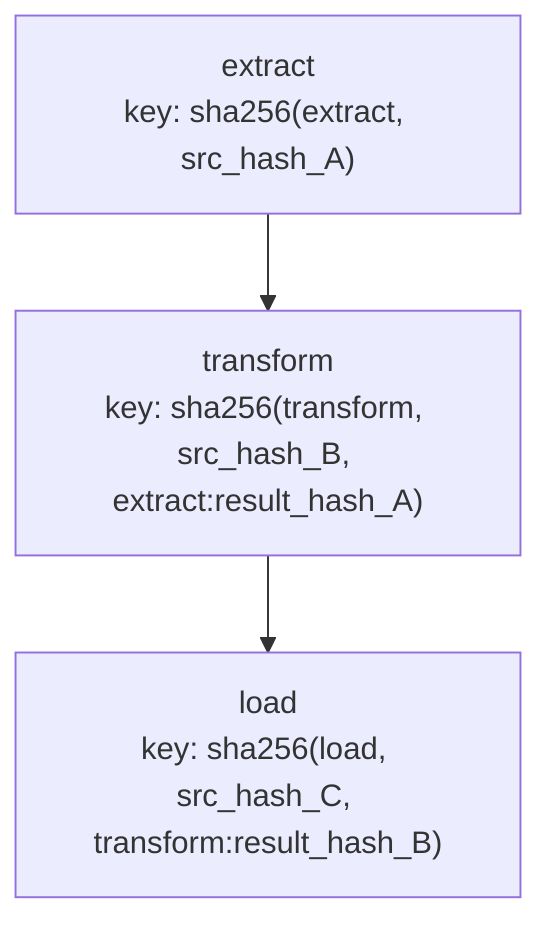

dagron's caching system provides **content-addressable Merkle-tree caching** for DAG execution results. When you re-execute a pipeline, nodes whose inputs have not changed return their cached result instantly -- no recomputation needed. This is conceptually similar to how build systems like Bazel and Nix work: change any upstream node and all downstream cache keys automatically invalidate.

<DagDiagram
  chart={`graph TD
    A["extract"]
    B["transform"]
    C["load"]
    D["report"]
    A --> B --> C
    A --> D
    style A fill:#c8e6c9,stroke:#2e7d32
    style B fill:#c8e6c9,stroke:#2e7d32
    style C fill:#fff9c4,stroke:#f9a825
    style D fill:#c8e6c9,stroke:#2e7d32`}
  caption="Green nodes are cache hits. Yellow nodes had an upstream change and must re-execute."
/>

---

## How Merkle-Tree Keys Work

For each node, dagron computes a cache key from three inputs:

1. **Node name** -- the identity of the node.
2. **Task source hash** -- a hash of the callable's source code (or bytecode as fallback).
3. **Predecessor result hashes** -- the hashes of all upstream nodes' results, sorted by name.

```
cache_key = SHA256( node_name || task_source_hash || pred1_name:pred1_hash || pred2_name:pred2_hash )
```

Because each node's key includes the hashes of its predecessors' results, a change to **any** upstream node automatically produces a different key for all downstream nodes. This is the "Merkle tree" property -- changes propagate without explicitly tracking what changed.



---

## Core Classes

| Class | Role |
|---|---|
| [`CachedDAGExecutor`](/api/execution/caching#cacheddagexecutor) | Executes a DAG with caching. On cache hit, returns stored result without running the task. |
| [`ContentAddressableCache`](/api/execution/caching#contentaddressablecache) | High-level cache that manages Merkle-tree key computation and delegates storage to a backend. |
| [`CacheKeyBuilder`](/api/execution/caching#cachekeybuilder) | Computes SHA-256 cache keys from node name, task hash, and predecessor hashes. |
| [`CachePolicy`](/api/execution/caching#cachepolicy) | Eviction rules: `max_entries`, `max_size_bytes`, `ttl_seconds`. |
| [`FileSystemCacheBackend`](/api/execution/caching#filesystemcachebackend) | Stores cached values as pickle files on disk with an index for LRU/TTL tracking. |
| [`CacheStats`](/api/execution/caching#cachestats) | Hit count, miss count, eviction count, total entries, total size, and computed `hit_rate`. |
| [`CacheKeyProtocol`](/api/execution/caching#cachekeyprotocol) | Protocol for objects that provide their own cache key via `__dagron_cache_key__()`. |

---

## Quick Start

```python
import dagron
from dagron.execution.cached_executor import CachedDAGExecutor
from dagron.execution.content_cache import (
    CachePolicy,
    ContentAddressableCache,
    FileSystemCacheBackend,
)

# 1. Build the DAG
dag = (
    dagron.DAG.builder()
    .add_node("fetch")
    .add_node("clean")
    .add_node("aggregate")
    .add_node("report")
    .add_edge("fetch", "clean")
    .add_edge("clean", "aggregate")
    .add_edge("aggregate", "report")
    .build()
)

# 2. Create a cache backend with eviction policy
policy = CachePolicy(
    max_entries=1000,
    max_size_bytes=500 * 1024 * 1024,  # 500 MB
    ttl_seconds=3600,                    # 1 hour
)
backend = FileSystemCacheBackend("/tmp/dagron_cache", policy=policy)
cache = ContentAddressableCache(backend)

# 3. Define tasks
tasks = {
    "fetch":     lambda: {"rows": 10000},
    "clean":     lambda: {"rows": 9800},
    "aggregate": lambda: {"total": 42.0},
    "report":    lambda: "Report generated",
}

# 4. First run -- all cache misses
executor = CachedDAGExecutor(dag, cache)
result = executor.execute(tasks)
print(f"Hits: {result.cache_hits}, Misses: {result.cache_misses}")
# Hits: 0, Misses: 4

# 5. Second run -- all cache hits (tasks unchanged)
result = executor.execute(tasks)
print(f"Hits: {result.cache_hits}, Misses: {result.cache_misses}")
# Hits: 4, Misses: 0
```

---

## CachedExecutionResult

The `CachedDAGExecutor.execute()` method returns a `CachedExecutionResult` that wraps the standard `ExecutionResult` and adds cache-specific statistics:

```python
result = executor.execute(tasks)

# Standard execution stats
print(result.execution_result.succeeded)
print(result.execution_result.failed)

# Cache stats
print(f"Cache hits:   {result.cache_hits}")
print(f"Cache misses: {result.cache_misses}")
print(f"Nodes executed (cache miss): {result.nodes_executed}")
print(f"Nodes cached (cache hit):    {result.nodes_cached}")
```

When a node is a cache hit, its result status is `NodeStatus.CACHE_HIT` and `duration_seconds` is `0.0`.

---

## Cache Invalidation

The Merkle-tree approach provides **automatic invalidation**. You never need to manually invalidate cache entries. Here is how changes propagate:

### Change a task's code

If you modify the source code of a task function, its source hash changes, which changes its cache key:

```python
# Original
tasks["clean"] = lambda: {"rows": 9800}

# Modified -- different source, different key
tasks["clean"] = lambda: {"rows": 9800, "filtered": True}

result = executor.execute(tasks)
# clean is a cache miss, and so are aggregate and report (downstream)
```

### Change an upstream result

If `fetch` returns different data, its result hash changes, which invalidates `clean`, `aggregate`, and `report`:

```python
tasks["fetch"] = lambda: {"rows": 20000}  # different result

result = executor.execute(tasks)
# All 4 nodes are cache misses because the root changed
```

### Unchanged branches stay cached

If only one branch changes, the other branch remains cached:

<DagDiagram
  chart={`graph TD
    raw["raw_data"]
    clean["clean"]
    stats["statistics"]
    model["model"]
    report["report"]
    raw --> clean
    clean --> stats
    clean --> model
    stats --> report
    model --> report
    style raw fill:#fff9c4,stroke:#f9a825
    style clean fill:#fff9c4,stroke:#f9a825
    style stats fill:#fff9c4,stroke:#f9a825
    style model fill:#c8e6c9,stroke:#2e7d32
    style report fill:#fff9c4,stroke:#f9a825`}
  caption="If raw_data changes but the model task source is identical, model may still be a cache hit if its upstream result hash is the same."
/>

---

## CachePolicy and Eviction

The `CachePolicy` controls when old entries are evicted:

```python
from dagron.execution.content_cache import CachePolicy

policy = CachePolicy(
    max_entries=500,            # LRU eviction after 500 entries
    max_size_bytes=1_073_741_824,  # 1 GB total
    ttl_seconds=7200,           # entries expire after 2 hours
)
```

| Parameter | Behavior |
|---|---|
| `max_entries` | When the entry count exceeds this, the **least recently accessed** entry is evicted. |
| `max_size_bytes` | When total size exceeds this, LRU entries are evicted until the size is under the limit. |
| `ttl_seconds` | Entries older than this are treated as expired on read and automatically removed. |

All three constraints are checked during `put()`. TTL is also checked during `get()`.

---

## FileSystemCacheBackend

The `FileSystemCacheBackend` stores values as pickle files and maintains a JSON index for metadata:

```python
from dagron.execution.content_cache import FileSystemCacheBackend

backend = FileSystemCacheBackend(
    cache_dir="/var/cache/dagron/my_pipeline",
    policy=CachePolicy(max_entries=1000, ttl_seconds=86400),
)
```

The directory structure looks like:

```
/var/cache/dagron/my_pipeline/
    index.json          # metadata index (atomic writes)
    a1b2c3d4e5f6g7h8.pkl  # pickled result (key prefix)
    ...
```

The backend uses **atomic writes** (`write to .tmp, then rename`) so that cache corruption from crashes is avoided.

### Backend Operations

```python
# Get a cached value
value, found = backend.get("sha256_key_here")

# Store a value
from dagron.execution.content_cache import CacheEntryMetadata
meta = CacheEntryMetadata(node_name="clean", cache_key="sha256_key_here")
backend.put("sha256_key_here", {"rows": 9800}, meta)

# Check existence
exists = backend.has("sha256_key_here")

# Delete a specific entry
backend.delete("sha256_key_here")

# Clear the entire cache
backend.clear()

# Get statistics
stats = backend.stats()
print(f"Entries: {stats.total_entries}, Size: {stats.total_size_bytes} bytes")
```

---

## CacheStats

After execution, inspect cache health:

```python
stats = cache.stats()
print(f"Hits:      {stats.hits}")
print(f"Misses:    {stats.misses}")
print(f"Evictions: {stats.evictions}")
print(f"Entries:   {stats.total_entries}")
print(f"Size:      {stats.total_size_bytes / 1024 / 1024:.1f} MB")
print(f"Hit rate:  {stats.hit_rate:.1%}")
```

A healthy pipeline running repeatedly should converge toward a high `hit_rate` (90%+ when only a few nodes change between runs).

---

## Custom Cache Keys with CacheKeyProtocol

If your task returns objects that are not easily serializable via `pickle`, implement the `CacheKeyProtocol`:

```python
from dagron.execution.content_cache import CacheKeyProtocol

class TrainedModel:
    def __init__(self, weights_path: str, metrics: dict):
        self.weights_path = weights_path
        self.metrics = metrics

    def __dagron_cache_key__(self) -> str:
        """Return a stable, deterministic cache key."""
        import hashlib
        content = f"{self.weights_path}:{sorted(self.metrics.items())}"
        return hashlib.sha256(content.encode()).hexdigest()
```

When dagron hashes this object's result, it calls `__dagron_cache_key__()` instead of pickling the entire object. This is useful for:

- Large objects where pickle is expensive.
- Objects with non-deterministic pickle output.
- Objects that reference external state (file paths, database connections).

---

## ContentAddressableCache API

The `ContentAddressableCache` is the high-level interface you pass to `CachedDAGExecutor`:

```python
from dagron.execution.content_cache import ContentAddressableCache

cache = ContentAddressableCache(backend)

# Compute a cache key for a node
key = cache.compute_key(
    node_name="clean",
    task_fn=clean_fn,
    predecessor_result_hashes={"fetch": "a1b2c3..."},
)

# Get / put / check
value, found = cache.get(key)
cache.put(key, {"rows": 9800}, node_name="clean")
cache.has(key)

# Clear all entries
cache.clear()

# Get stats
stats = cache.stats()
```

---

## Combining Caching with Other Features

### Caching + Tracing

Enable tracing to see which nodes were cache hits vs misses in the execution timeline:

```python
executor = CachedDAGExecutor(dag, cache, enable_tracing=True)
result = executor.execute(tasks)

trace = result.execution_result.trace
if trace:
    trace.to_chrome_json("cached_run.json")
```

The trace will include `NODE_CACHE_HIT` and `NODE_CACHE_MISS` events.

### Caching + Fail-Fast

By default, `fail_fast=True`. If a node fails, downstream nodes are skipped (not cached):

```python
executor = CachedDAGExecutor(dag, cache, fail_fast=True)
```

### Caching vs Incremental Execution

dagron also provides an [IncrementalExecutor](/guide/execution-strategies/incremental) that re-executes only nodes in the "dirty set" of explicitly changed nodes. The key difference:

| Feature | CachedDAGExecutor | IncrementalExecutor |
|---|---|---|
| Cross-run persistence | Yes (disk-backed) | No (in-memory) |
| Invalidation | Automatic (Merkle keys) | Manual (`changed_nodes` list) |
| Overhead | Hash computation + disk I/O | Dirty-set computation |
| Best for | CI pipelines, batch jobs | Interactive/reactive workflows |

You can use both together: `CachedDAGExecutor` for cross-run caching and `IncrementalExecutor` for within-run incremental updates.

---

## Writing a Custom Backend

Implement the `CacheBackend` protocol to use Redis, S3, or any storage system:

```python
from dagron.execution.content_cache import CacheBackend, CacheEntryMetadata, CacheStats

class RedisCacheBackend:
    """Example Redis-backed cache backend."""

    def __init__(self, redis_url: str):
        import redis
        self._client = redis.from_url(redis_url)
        self._stats = CacheStats()

    def get(self, key: str) -> tuple[any, bool]:
        data = self._client.get(f"dagron:{key}")
        if data is None:
            self._stats.misses += 1
            return None, False
        import pickle
        self._stats.hits += 1
        return pickle.loads(data), True

    def put(self, key: str, value: any, metadata: CacheEntryMetadata) -> None:
        import pickle
        data = pickle.dumps(value)
        self._client.set(f"dagron:{key}", data)

    def has(self, key: str) -> bool:
        return self._client.exists(f"dagron:{key}") > 0

    def delete(self, key: str) -> None:
        self._client.delete(f"dagron:{key}")

    def clear(self) -> None:
        for key in self._client.scan_iter("dagron:*"):
            self._client.delete(key)

    def stats(self) -> CacheStats:
        return self._stats

# Usage
backend = RedisCacheBackend("redis://localhost:6379")
cache = ContentAddressableCache(backend)
executor = CachedDAGExecutor(dag, cache)
```

---

## Best Practices

1. **Use a TTL in production.** Without a TTL, stale cache entries from old pipeline versions can accumulate. A TTL of 24-48 hours is a reasonable default.

2. **Set `max_size_bytes`.** Prevent the cache from consuming unbounded disk space.

3. **Use `CacheKeyProtocol` for large objects.** If your nodes return multi-GB DataFrames, implement `__dagron_cache_key__()` to hash a fingerprint instead of the full data.

4. **Monitor `hit_rate`.** A low hit rate suggests frequent code changes or non-deterministic task outputs. Check `CacheStats` after each run.

5. **Share caches across CI runs.** Mount the cache directory as a persistent volume in your CI system to get cross-run cache hits.

---

## Related

- [API Reference: Caching](/api/execution/caching) -- full API documentation.
- [Incremental Execution](/guide/execution-strategies/incremental) -- in-memory dirty-set-based re-execution.
- [Tracing & Profiling](/guide/observability/tracing-profiling) -- visualizing cache hit/miss events.
- [Checkpointing](/guide/execution-strategies/checkpointing) -- saving and resuming execution state.
