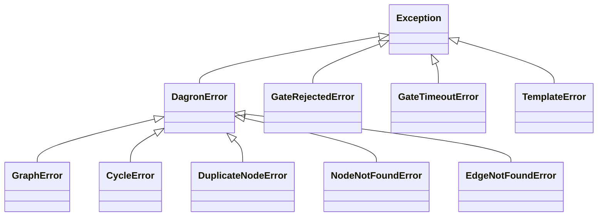

Pipelines fail. Data is missing, APIs time out, code has bugs. dagron provides a structured error hierarchy, clear fail-fast semantics, and patterns for graceful error recovery so you can build pipelines that handle failure predictably.

---

## Error Hierarchy

All dagron-specific errors inherit from `DagronError`, which itself inherits from Python's `Exception`. This gives you a single base class to catch all dagron errors:



### Core Errors

These are raised by the Rust-backed graph engine:

| Error | When it is raised |
|---|---|
| `DagronError` | Base class for all dagron errors. Never raised directly. |
| `GraphError` | General graph structure error (e.g., invalid operation on the graph). |
| `CycleError` | Adding an edge would create a cycle, violating the DAG property. |
| `DuplicateNodeError` | Adding a node with a name that already exists in the graph. |
| `NodeNotFoundError` | Referencing a node name that does not exist. |
| `EdgeNotFoundError` | Referencing an edge that does not exist (e.g., during removal). |

### Execution Errors

These are raised during task execution:

| Error | When it is raised |
|---|---|
| `GateRejectedError` | An [approval gate](/guide/execution-strategies/approval-gates) was rejected. |
| `GateTimeoutError` | An approval gate timed out before a decision was made. |
| `TemplateError` | A [template](/guide/advanced/templates) parameter is invalid. |

---

## Graph Construction Errors

### CycleError

The most common graph error. Raised when adding an edge would create a cycle:

```python
import dagron

dag = dagron.DAG()
dag.add_node("a")
dag.add_node("b")
dag.add_node("c")
dag.add_edge("a", "b")
dag.add_edge("b", "c")

try:
    dag.add_edge("c", "a")  # would create a -> b -> c -> a cycle
except dagron.CycleError as e:
    print(f"Cycle detected: {e}")
```

<DagDiagram
  chart={`graph TD
    A["a"]
    B["b"]
    C["c"]
    A --> B --> C
    C -.->|"rejected"| A
    style C fill:#ffcdd2,stroke:#c62828`}
  caption="The edge c -> a is rejected because it would create a cycle."
/>

Use the builder pattern with `allow_cycles=False` (the default) to catch cycles at build time:

```python
try:
    dag = (
        dagron.DAG.builder()
        .add_node("a").add_node("b").add_node("c")
        .add_edge("a", "b")
        .add_edge("b", "c")
        .add_edge("c", "a")  # CycleError raised here
        .build()
    )
except dagron.CycleError:
    print("Cannot build: graph contains a cycle")
```

### DuplicateNodeError

Raised when you try to add a node with a name that already exists:

```python
dag = dagron.DAG()
dag.add_node("extract")

try:
    dag.add_node("extract")  # already exists
except dagron.DuplicateNodeError as e:
    print(f"Duplicate: {e}")
```

### NodeNotFoundError

Raised when referencing a node that does not exist:

```python
dag = dagron.DAG()
dag.add_node("a")

try:
    dag.add_edge("a", "b")  # "b" does not exist
except dagron.NodeNotFoundError as e:
    print(f"Not found: {e}")
```

Also raised when trying to get the payload, metadata, or predecessors of a nonexistent node:

```python
try:
    dag.get_payload("nonexistent")
except dagron.NodeNotFoundError:
    print("Node does not exist")
```

### EdgeNotFoundError

Raised when trying to remove or reference an edge that does not exist:

```python
dag = dagron.DAG()
dag.add_node("a")
dag.add_node("b")

try:
    dag.remove_edge("a", "b")  # no edge between a and b
except dagron.EdgeNotFoundError as e:
    print(f"Edge not found: {e}")
```

### GraphError

A general graph error for operations that are not covered by the more specific errors:

```python
try:
    dag.some_invalid_operation()
except dagron.GraphError as e:
    print(f"Graph error: {e}")
```

---

## Catching All dagron Errors

Use `DagronError` as a catch-all:

```python
import dagron

try:
    dag = (
        dagron.DAG.builder()
        .add_node("a")
        .add_edge("a", "nonexistent")
        .build()
    )
except dagron.DagronError as e:
    print(f"dagron error: {type(e).__name__}: {e}")
```

This catches `CycleError`, `DuplicateNodeError`, `NodeNotFoundError`, `EdgeNotFoundError`, and `GraphError`.

---

## Fail-Fast Execution

During execution, dagron uses **fail-fast** semantics by default. When a node fails, all downstream nodes are immediately skipped:

```python
dag = (
    dagron.DAG.builder()
    .add_node("extract")
    .add_node("transform")
    .add_node("load")
    .add_node("report")
    .add_edge("extract", "transform")
    .add_edge("transform", "load")
    .add_edge("load", "report")
    .build()
)

def failing_transform():
    raise ValueError("Bad data format")

executor = dagron.DAGExecutor(dag)
result = executor.execute({
    "extract":   lambda: "raw data",
    "transform": failing_transform,
    "load":      lambda: "loaded",
    "report":    lambda: "report",
})

for name, nr in result.node_results.items():
    print(f"  {name}: {nr.status.value}")
```

Output:

```
  extract:   completed
  transform: failed
  load:      skipped
  report:    skipped
```

<DagDiagram
  chart={`graph TD
    extract["extract &#x2705;"]
    transform["transform &#x274C;"]
    load["load &#x23ED;"]
    report["report &#x23ED;"]
    extract --> transform --> load --> report
    style extract fill:#c8e6c9,stroke:#2e7d32
    style transform fill:#ffcdd2,stroke:#c62828
    style load fill:#e0e0e0,stroke:#9e9e9e
    style report fill:#e0e0e0,stroke:#9e9e9e`}
  caption="When transform fails, load and report are skipped."
/>

### Disabling Fail-Fast

Set `fail_fast=False` to let independent branches continue executing:

```python
dag = (
    dagron.DAG.builder()
    .add_node("extract")
    .add_node("path_a")
    .add_node("path_b")
    .add_node("merge")
    .add_edge("extract", "path_a")
    .add_edge("extract", "path_b")
    .add_edge("path_a", "merge")
    .add_edge("path_b", "merge")
    .build()
)

executor = dagron.DAGExecutor(dag, fail_fast=False)
result = executor.execute({
    "extract": lambda: "data",
    "path_a":  lambda: 1 / 0,     # fails
    "path_b":  lambda: "success",  # still runs
    "merge":   lambda: "merged",   # still runs (has at least one completed dep)
})

for name, nr in result.node_results.items():
    print(f"  {name}: {nr.status.value}")
```

Output:

```
  extract: completed
  path_a:  failed
  path_b:  completed
  merge:   completed
```

---

## Inspecting Node Errors

Each `NodeResult` contains the original exception if the node failed:

```python
for name, nr in result.node_results.items():
    if nr.status == dagron.NodeStatus.FAILED:
        print(f"Node '{name}' failed:")
        print(f"  Error type: {type(nr.error).__name__}")
        print(f"  Message:    {nr.error}")
        print(f"  Duration:   {nr.duration_seconds:.3f}s")
```

---

## ExecutionResult Summary

The `ExecutionResult` provides aggregate counts:

```python
result = executor.execute(tasks)

print(f"Succeeded:  {result.succeeded}")
print(f"Failed:     {result.failed}")
print(f"Skipped:    {result.skipped}")
print(f"Timed out:  {result.timed_out}")
print(f"Cancelled:  {result.cancelled}")
print(f"Duration:   {result.total_duration_seconds:.1f}s")

# Check if the entire execution succeeded
if result.failed == 0:
    print("All nodes completed successfully")
else:
    print(f"{result.failed} node(s) failed")
```

---

## Error Recovery Patterns

### Pattern: Retry with Backoff

Wrap tasks in a retry decorator:

```python
import time

def retry(fn, max_retries=3, backoff=1.0):
    """Retry a task function with exponential backoff."""
    def wrapper():
        last_error = None
        for attempt in range(max_retries):
            try:
                return fn()
            except Exception as e:
                last_error = e
                if attempt < max_retries - 1:
                    time.sleep(backoff * (2 ** attempt))
        raise last_error
    return wrapper

tasks = {
    "fetch_api": retry(lambda: call_flaky_api(), max_retries=3),
    "process":   lambda: process_data(),
}
```

### Pattern: Fallback Values

Provide a fallback when a task fails:

```python
def with_fallback(fn, default):
    """Return a default value if the task fails."""
    def wrapper():
        try:
            return fn()
        except Exception:
            return default
    return wrapper

tasks = {
    "fetch_cache": with_fallback(lambda: get_from_cache(), default=None),
    "fetch_api":   with_fallback(lambda: get_from_api(), default={}),
}
```

### Pattern: Error Callbacks

Use execution callbacks to log errors as they happen:

```python
from dagron.execution._types import ExecutionCallbacks

def on_failure(name, error):
    log.error(f"Node '{name}' failed: {error}")
    send_alert(f"Pipeline node '{name}' failed")

callbacks = ExecutionCallbacks(
    on_failure=on_failure,
)

executor = dagron.DAGExecutor(dag, callbacks=callbacks)
```

### Pattern: Checkpoint and Resume

Use [checkpointing](/guide/execution-strategies/checkpointing) to save progress and resume after fixing the failure:

```python
from dagron.execution.checkpoint import CheckpointExecutor

executor = CheckpointExecutor(dag, checkpoint_dir="/tmp/checkpoints")
result = executor.execute(tasks)

if result.failed > 0:
    # Fix the failing task, then resume from the checkpoint
    result = executor.resume(tasks)
```

### Pattern: Graceful Degradation

Design your DAG so that non-critical branches can fail without affecting the critical path:

```python
dag = (
    dagron.DAG.builder()
    .add_node("extract")
    .add_node("transform")       # critical
    .add_node("load")            # critical
    .add_node("send_metrics")    # non-critical
    .add_node("send_slack")      # non-critical
    .add_edge("extract", "transform")
    .add_edge("transform", "load")
    .add_edge("transform", "send_metrics")
    .add_edge("load", "send_slack")
    .build()
)

# With fail_fast=False, metrics/slack failures don't block load
executor = dagron.DAGExecutor(dag, fail_fast=False)
```

<DagDiagram
  chart={`graph TD
    extract["extract"]
    transform["transform"]
    load["load &#x2B50; critical"]
    metrics["send_metrics<br/>(non-critical)"]
    slack["send_slack<br/>(non-critical)"]
    extract --> transform
    transform --> load
    transform --> metrics
    load --> slack
    style load fill:#c8e6c9,stroke:#2e7d32
    style metrics fill:#fff9c4,stroke:#f9a825
    style slack fill:#fff9c4,stroke:#f9a825`}
  caption="Non-critical branches can fail independently without affecting the critical path."
/>

---

## Gate Errors

[Approval gates](/guide/execution-strategies/approval-gates) raise their own errors:

```python
from dagron.execution.gates import GateRejectedError, GateTimeoutError

try:
    controller.wait_sync("deploy")
except GateRejectedError as e:
    print(f"Gate '{e.gate_name}' rejected: {e.reason}")
except GateTimeoutError as e:
    print(f"Gate '{e.gate_name}' timed out after {e.timeout}s")
```

These errors are **not** subclasses of `DagronError` since they originate from the execution layer, not the graph engine.

---

## Template Errors

[Template](/guide/advanced/templates) parameter validation raises `TemplateError`:

```python
from dagron.template import DAGTemplate, TemplateError

template = DAGTemplate(params={"env": str})

try:
    template.render(env=42)  # wrong type
except TemplateError as e:
    print(f"Template error: {e}")
    # "Parameter 'env' expects str, got int"
```

---

## Error Handling in Hooks

[Plugin hooks](/guide/advanced/plugins-hooks) catch and warn on callback errors to prevent them from breaking execution:

```python
from dagron.plugins.hooks import HookRegistry, HookEvent, HookContext

hooks = HookRegistry()

def buggy_hook(ctx: HookContext):
    raise RuntimeError("hook crashed")

hooks.register(HookEvent.PRE_NODE, buggy_hook)

# This fires the hook but does NOT raise.
# Instead, a RuntimeWarning is issued.
hooks.fire(HookContext(event=HookEvent.PRE_NODE))
```

If you need to observe hook errors, use Python's `warnings` module:

```python
import warnings

with warnings.catch_warnings(record=True) as w:
    warnings.simplefilter("always")
    hooks.fire(HookContext(event=HookEvent.PRE_NODE))
    if w:
        print(f"Hook warning: {w[0].message}")
```

---

## Defensive DAG Construction

Use try/except around builder operations to build robust DAG construction code:

```python
import dagron

def build_pipeline_safely(node_specs):
    """Build a DAG from specs, skipping invalid entries."""
    builder = dagron.DAG.builder()
    errors = []

    for spec in node_specs:
        try:
            builder.add_node(spec["name"])
        except dagron.DuplicateNodeError:
            errors.append(f"Duplicate node: {spec['name']}")

    for spec in node_specs:
        for dep in spec.get("dependencies", []):
            try:
                builder.add_edge(dep, spec["name"])
            except dagron.NodeNotFoundError as e:
                errors.append(f"Missing dependency: {e}")
            except dagron.CycleError as e:
                errors.append(f"Would create cycle: {e}")

    if errors:
        print(f"Warnings during build ({len(errors)}):")
        for err in errors:
            print(f"  - {err}")

    return builder.build()
```

---

## Error Hierarchy Summary

```python
import dagron
from dagron.execution.gates import GateRejectedError, GateTimeoutError
from dagron.template import TemplateError

# Graph engine errors (from Rust)
dagron.DagronError          # base class
dagron.GraphError           # general graph error
dagron.CycleError           # edge would create a cycle
dagron.DuplicateNodeError   # node already exists
dagron.NodeNotFoundError    # node does not exist
dagron.EdgeNotFoundError    # edge does not exist

# Execution errors (from Python)
GateRejectedError           # gate was rejected
GateTimeoutError            # gate timed out
TemplateError               # template parameter invalid
```

---

## Best Practices

1. **Catch specific errors.** Use `CycleError`, `NodeNotFoundError`, etc. instead of the broad `DagronError` when you know what might go wrong.

2. **Use `fail_fast=True` by default.** This prevents wasting compute on nodes that will fail anyway due to missing upstream data.

3. **Disable fail-fast for non-critical branches.** If some branches are optional (metrics, notifications), use `fail_fast=False` so they do not block the critical path.

4. **Log errors via callbacks.** Use `ExecutionCallbacks.on_failure` to capture errors as they happen, not just at the end.

5. **Inspect `NodeResult.error`.** When a node fails, the original exception is preserved for debugging.

6. **Use retry wrappers for transient failures.** Network errors, API rate limits, and temporary file locks benefit from retry logic.

7. **Checkpoint long-running pipelines.** For pipelines that take hours, use checkpointing so you do not lose progress on failure.

---

## Related

- [API Reference: Errors](/api/core/errors) -- full documentation for all error classes.
- [Executing Tasks](/guide/core-concepts/executing-tasks) -- how fail-fast works in the executor.
- [Approval Gates](/guide/execution-strategies/approval-gates) -- `GateRejectedError` and `GateTimeoutError`.
- [Templates](/guide/advanced/templates) -- `TemplateError`.
- [Checkpointing](/guide/execution-strategies/checkpointing) -- saving and resuming execution state.
- [Plugins & Hooks](/guide/advanced/plugins-hooks) -- error isolation in hooks.
