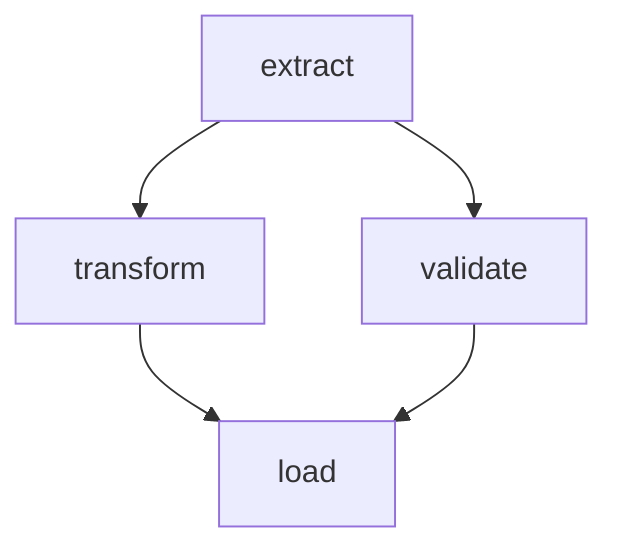

dagron provides multiple ways to visualize your DAGs, from quick ASCII previews in the terminal to rich SVG renderings in Jupyter notebooks and live web dashboards for production monitoring.

| Method | Output | Best for |
|---|---|---|
| `pretty_print()` | ASCII text | Terminal, logs, CI output |
| `_repr_svg_()` | SVG | Jupyter notebooks |
| `dag.to_dot()` | Graphviz DOT | External tools, custom rendering |
| `dag.to_mermaid()` | Mermaid syntax | Documentation, Markdown |
| `DashboardPlugin` | Live web UI | Production monitoring, gate approval |

---

## ASCII Pretty Print

The `pretty_print()` function renders a DAG as an ASCII diagram directly in the terminal:

```python
import dagron
from dagron.display import pretty_print

dag = (
    dagron.DAG.builder()
    .add_node("extract")
    .add_node("transform")
    .add_node("validate")
    .add_node("load")
    .add_edge("extract", "transform")
    .add_edge("extract", "validate")
    .add_edge("transform", "load")
    .add_edge("validate", "load")
    .build()
)

print(pretty_print(dag))
```

Output:

```
           [ extract ]
        +---------------+
  [ transform ]  [ validate ]
        +---------------+
            [ load ]
```

### Layout Options

Choose between vertical (top-to-bottom) and horizontal (left-to-right) layouts:

```python
# Vertical (default)
print(pretty_print(dag, layout="vertical"))

# Horizontal
print(pretty_print(dag, layout="horizontal"))
```

Horizontal output:

```
[ extract ]-->[ transform ]-->[ load ]
              [ validate ]--->
```

### Show Payloads

Include node payloads in the ASCII output:

```python
dag = (
    dagron.DAG.builder()
    .add_node("extract", payload="csv")
    .add_node("transform", payload="pandas")
    .add_node("load", payload="postgres")
    .add_edge("extract", "transform")
    .add_edge("transform", "load")
    .build()
)

print(pretty_print(dag, show_payloads=True))
```

Output:

```
  [ extract=csv ]
        |
  [ transform=pandas ]
        |
  [ load=postgres ]
```

### Custom Formatters

Supply a custom formatter to control node labels:

```python
def status_formatter(name, payload):
    status = payload or "pending"
    return f"{name} ({status})"

print(pretty_print(dag, node_formatter=status_formatter))
```

### Max Nodes Guard

For large graphs, `pretty_print` raises `ValueError` to prevent terminal floods:

```python
try:
    print(pretty_print(huge_dag))
except ValueError as e:
    print(e)
    # "Graph has 500 nodes, exceeding max_nodes=50. Increase max_nodes to render."

# Override the limit
print(pretty_print(huge_dag, max_nodes=500))
```

---

## Jupyter SVG Rendering

In Jupyter notebooks, dagron DAGs render as SVG automatically. The `_repr_svg_()` function is called by Jupyter's display system:

```python
# In a Jupyter notebook cell:
dag  # displays as an SVG graph
```

The rendering strategy has multiple fallbacks:

1. **graphviz Python package** -- if installed, produces high-quality SVG via `Source(dot).pipe()`.
2. **dot CLI** -- if the `graphviz` system package is installed, calls `dot -Tsvg`.
3. **ASCII fallback** -- wraps the ASCII pretty-print output in an SVG `<text>` element.

### Installing Graphviz

For the best Jupyter experience, install graphviz:

```bash
# Python package
pip install graphviz

# System package (needed by the Python package)
# Ubuntu/Debian:
sudo apt install graphviz
# macOS:
brew install graphviz
```

### Direct SVG Generation

You can also call `_repr_svg_()` directly:

```python
from dagron.display import _repr_svg_

svg_string = _repr_svg_(dag)

# Save to file
with open("pipeline.svg", "w") as f:
    f.write(svg_string)
```

### Large Graph Handling

For graphs exceeding `max_nodes` (default 100), a summary SVG is returned instead:

```
DAG(nodes=500, edges=1200) -- too large to render
```

---

## Graphviz DOT Export

Export the DAG as a Graphviz DOT string for use with external tools:

```python
dot_string = dag.to_dot()
print(dot_string)
```

Output:

```text
digraph {
    rankdir=TB;
    node [shape=box, style=rounded];
    "extract" -> "transform";
    "extract" -> "validate";
    "transform" -> "load";
    "validate" -> "load";
}
```

### Rendering with Graphviz

```python
import graphviz

src = graphviz.Source(dag.to_dot())
src.render("pipeline", format="png", cleanup=True)
# Creates pipeline.png
```

### Command-Line Rendering

```bash
python -c "import dagron; print(dagron.DAG.builder()...build().to_dot())" | dot -Tpng > pipeline.png
```

---

## Mermaid Export

Export as Mermaid syntax for embedding in Markdown documentation:

```python
mermaid_string = dag.to_mermaid()
print(mermaid_string)
```

Output:

```
graph TD
    extract --> transform
    extract --> validate
    transform --> load
    validate --> load
```

### Embedding in Markdown

````markdown

````

### Using with DagDiagram Component

In dagron's documentation site, use the `DagDiagram` component for interactive rendering:

```jsx
<DagDiagram
  chart={dag.to_mermaid()}
  caption="My pipeline"
/>
```

The `DagDiagram` component renders an interactive Mermaid diagram of your pipeline.

---

## Live Web Dashboard

For production monitoring, the `DashboardPlugin` serves a real-time web UI:

```python
from dagron.dashboard import DashboardPlugin
from dagron.plugins.hooks import HookRegistry
from dagron.plugins.manager import PluginManager

# Set up the dashboard
dashboard = DashboardPlugin(
    host="127.0.0.1",
    port=8765,
    open_browser=True,
)

hooks = HookRegistry()
manager = PluginManager(hooks)
manager.register(dashboard)
manager.initialize_all()
# prints: "Dashboard: http://127.0.0.1:8765"

# Execute with hooks
executor = dagron.DAGExecutor(dag, hooks=hooks)
result = executor.execute(tasks)

manager.teardown_all()
```

### Dashboard Features

The dashboard provides:

- **Live graph visualization** -- nodes change color as they transition through states:
  - <StatusBadge status="pending" /> Pending
  - <StatusBadge status="running" /> Running
  - <StatusBadge status="completed" /> Completed
  - <StatusBadge status="failed" /> Failed
  - <StatusBadge status="skipped" /> Skipped

- **Execution timeline** -- see which nodes are running at each point in time.

- **Gate management** -- if a `GateController` is provided, approve/reject buttons appear for waiting gates.

- **Execution summary** -- after completion, shows total duration and per-status counts.

### Dashboard with Gates

```python
from dagron.execution.gates import ApprovalGate, GateController

controller = GateController({
    "review":  ApprovalGate(timeout=600),
    "deploy":  ApprovalGate(timeout=300),
})

dashboard = DashboardPlugin(
    port=8765,
    gate_controller=controller,
)
```

When a gate enters `WAITING` state, the dashboard shows clickable **Approve** and **Reject** buttons.

### Technical Details

The dashboard web server is implemented in Rust using axum and tokio. It runs on a background OS thread and communicates with the Python hooks via thread-safe callbacks. The Rust implementation ensures low overhead even during high-frequency hook events.

<Callout type="note">
The dashboard requires dagron to be built with the `dashboard` Cargo feature. If it is not available, importing `DashboardPlugin` raises an `ImportError` with build instructions.
</Callout>
---

## Combining Visualization Methods

### Export All Formats

```python
import dagron
from dagron.display import pretty_print, _repr_svg_

dag = (
    dagron.DAG.builder()
    .add_node("A").add_node("B").add_node("C")
    .add_edge("A", "B").add_edge("A", "C")
    .build()
)

# ASCII
ascii_art = pretty_print(dag)
print(ascii_art)

# DOT
dot = dag.to_dot()
with open("graph.dot", "w") as f:
    f.write(dot)

# Mermaid
mermaid = dag.to_mermaid()
with open("graph.mmd", "w") as f:
    f.write(mermaid)

# SVG
svg = _repr_svg_(dag)
with open("graph.svg", "w") as f:
    f.write(svg)
```

### Visualization in CI Logs

Use `pretty_print()` to include a graph visualization in your CI output:

```python
import dagron
from dagron.display import pretty_print

def print_pipeline_summary(dag, result):
    """Print a visual summary at the end of a CI run."""
    print("\n--- Pipeline Graph ---")
    print(pretty_print(dag, layout="horizontal"))
    print(f"\n--- Results ---")
    print(f"  Succeeded: {result.succeeded}")
    print(f"  Failed:    {result.failed}")
    print(f"  Skipped:   {result.skipped}")
    print(f"  Duration:  {result.total_duration_seconds:.1f}s")
```

### Visualization in Documentation

Generate Mermaid diagrams for your project documentation:

````python
# Generate documentation diagrams
mermaid = dag.to_mermaid()

doc = f"""
# Pipeline Architecture

```mermaid
{mermaid}
```

This pipeline has {dag.node_count()} nodes and {dag.edge_count()} edges.
"""
````

---

## Best Practices

1. **Use `pretty_print()` for quick debugging.** It requires no external dependencies and works in any terminal.

2. **Install `graphviz` for Jupyter.** The SVG rendering is significantly better with the graphviz package.

3. **Use `to_mermaid()` for documentation.** Mermaid renders natively in GitHub, GitLab, and most documentation sites.

4. **Use `DashboardPlugin` for production.** The live dashboard gives operators real-time visibility and gate control.

5. **Set `max_nodes` appropriately.** For large graphs, increase `max_nodes` or use `to_dot()` with Graphviz's layout engines, which handle hundreds of nodes well.

6. **Export DOT for complex layouts.** When Mermaid's layout is not sufficient, use `to_dot()` and render with Graphviz's `neato`, `fdp`, or `sfdp` engines.

---

## Related

- [API Reference: Display](/api/utilities/display) -- full API documentation for visualization functions.
- [Plugins & Hooks](/guide/advanced/plugins-hooks) -- the plugin system that powers the DashboardPlugin.
- [Approval Gates](/guide/execution-strategies/approval-gates) -- gate approval via the dashboard UI.
- [Inspecting Graphs](/guide/core-concepts/inspecting-graphs) -- programmatic graph analysis.
