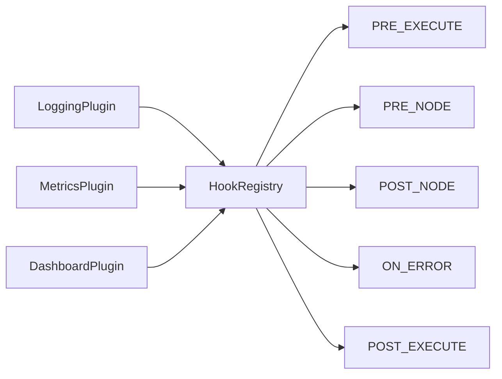

import DagDiagram from '@site/src/components/DagDiagram';
import StatusBadge from '@site/src/components/StatusBadge';

# Plugins & Hooks

dagron provides an event-driven plugin system that lets you hook into every stage of DAG construction and execution. Plugins can log events, collect metrics, serve live dashboards, send notifications, or implement any cross-cutting concern without modifying your pipeline code.

The system has three layers:

1. **HookRegistry** -- registers and fires callbacks for lifecycle events.
2. **DagronPlugin** -- abstract base class for plugin implementations.
3. **PluginManager** -- discovers, initializes, and tears down plugins.



---

## Hook Events

The `HookEvent` enum defines the lifecycle events you can subscribe to:

| Event | Fires when... | Context fields |
|---|---|---|
| `PRE_BUILD` | A DAGBuilder starts building. | `dag` (partial) |
| `POST_BUILD` | A DAGBuilder finishes building. | `dag` (complete) |
| `PRE_EXECUTE` | Execution begins. | `dag` |
| `POST_EXECUTE` | Execution completes. | `dag`, `execution_result` |
| `PRE_NODE` | A node is about to execute. | `dag`, `node_name` |
| `POST_NODE` | A node has finished executing. | `dag`, `node_name`, `node_result` |
| `ON_ERROR` | A node raises an exception. | `dag`, `node_name`, `error` |

```python
from dagron.plugins.hooks import HookEvent

HookEvent.PRE_EXECUTE    # "pre_execute"
HookEvent.POST_EXECUTE   # "post_execute"
HookEvent.PRE_NODE       # "pre_node"
HookEvent.POST_NODE      # "post_node"
HookEvent.ON_ERROR       # "on_error"
HookEvent.PRE_BUILD      # "pre_build"
HookEvent.POST_BUILD     # "post_build"
```

---

## HookRegistry

The `HookRegistry` is the central event bus. You register callbacks for specific events and fire them with a `HookContext`:

```python
from dagron.plugins.hooks import HookRegistry, HookEvent, HookContext

hooks = HookRegistry()

# Register a callback
def on_node_start(ctx: HookContext):
    print(f"  Starting node: {ctx.node_name}")

unregister = hooks.register(HookEvent.PRE_NODE, on_node_start)

# Fire the event (the executor does this automatically)
hooks.fire(HookContext(
    event=HookEvent.PRE_NODE,
    dag=dag,
    node_name="extract",
))
# prints: "  Starting node: extract"

# Unregister when no longer needed
unregister()
```

### HookContext

Every callback receives a `HookContext` with the relevant information:

```python
from dagron.plugins.hooks import HookContext

ctx = HookContext(
    event=HookEvent.POST_NODE,
    dag=dag,
    node_name="transform",
    node_result=result,
    error=None,
    execution_result=None,
    metadata={"extra": "info"},
)
```

| Field | Type | Description |
|---|---|---|
| `event` | `HookEvent` | The event that triggered this callback. |
| `dag` | `DAG \| None` | The DAG being built or executed. |
| `node_name` | `str \| None` | The node involved (for node-level events). |
| `node_result` | `Any` | The node's result (for `POST_NODE`). |
| `error` | `Exception \| None` | The exception (for `ON_ERROR`). |
| `execution_result` | `Any` | The full execution result (for `POST_EXECUTE`). |
| `metadata` | `dict` | Arbitrary extra data. |

### Priority

Callbacks run in **descending priority order**. Higher priority runs first:

```python
hooks.register(HookEvent.PRE_NODE, first_callback, priority=100)
hooks.register(HookEvent.PRE_NODE, second_callback, priority=50)
hooks.register(HookEvent.PRE_NODE, last_callback, priority=0)

# Order: first_callback -> second_callback -> last_callback
```

### Error Isolation

Hook callbacks are fire-and-forget. If a callback raises an exception, it is caught and issued as a `RuntimeWarning`, but execution continues:

```python
def buggy_hook(ctx):
    raise ValueError("oops")

hooks.register(HookEvent.PRE_NODE, buggy_hook)

# This fires the hook but does NOT stop execution
# Instead, a RuntimeWarning is issued
hooks.fire(HookContext(event=HookEvent.PRE_NODE))
```

### Clearing Hooks

```python
# Clear all hooks for a specific event
hooks.clear(HookEvent.PRE_NODE)

# Clear all hooks for all events
hooks.clear()

# Count registered hooks
hooks.hook_count()                    # total across all events
hooks.hook_count(HookEvent.PRE_NODE)  # for a specific event
```

---

## Writing a Plugin

### DagronPlugin ABC

Subclass `DagronPlugin` and implement `name`, `initialize()`, and optionally `teardown()`:

```python
from dagron.plugins.base import DagronPlugin
from dagron.plugins.hooks import HookEvent, HookContext, HookRegistry


class TimingPlugin(DagronPlugin):
    """Plugin that measures and logs node execution times."""

    def __init__(self):
        self._start_times: dict[str, float] = {}

    @property
    def name(self) -> str:
        return "timing"

    def initialize(self, hooks: HookRegistry) -> None:
        """Register hooks for node timing."""
        import time

        def on_pre_node(ctx: HookContext):
            if ctx.node_name:
                self._start_times[ctx.node_name] = time.monotonic()

        def on_post_node(ctx: HookContext):
            if ctx.node_name and ctx.node_name in self._start_times:
                elapsed = time.monotonic() - self._start_times[ctx.node_name]
                print(f"  [{ctx.node_name}] completed in {elapsed:.3f}s")

        hooks.register(HookEvent.PRE_NODE, on_pre_node)
        hooks.register(HookEvent.POST_NODE, on_post_node)

    def teardown(self) -> None:
        """Clean up resources."""
        self._start_times.clear()
```

### Using the Plugin

```python
from dagron.plugins.hooks import HookRegistry
from dagron.plugins.manager import PluginManager

# Create the hook registry and plugin manager
hooks = HookRegistry()
manager = PluginManager(hooks)

# Register and initialize plugins
manager.register(TimingPlugin())
manager.initialize_all()

# Pass hooks to the executor
executor = dagron.DAGExecutor(dag, hooks=hooks)
result = executor.execute(tasks)

# Clean up
manager.teardown_all()
```

---

## PluginManager

The `PluginManager` handles the plugin lifecycle:

```python
from dagron.plugins.manager import PluginManager

manager = PluginManager()

# Register plugins manually
manager.register(TimingPlugin())
manager.register(LoggingPlugin())

# Auto-discover plugins from entry_points
discovered = manager.discover()
print(f"Discovered: {discovered}")

# Initialize all registered plugins
manager.initialize_all()

# Access the shared hook registry
hooks = manager.hooks

# List registered plugins
print(manager.plugins)

# Tear down all plugins
manager.teardown_all()
```

### Plugin Discovery

Plugins can be auto-discovered via Python entry points. Add to your `pyproject.toml`:

```toml
[project.entry-points."dagron.plugins"]
my_plugin = "my_package.plugins:MyPlugin"
```

Then `manager.discover()` will find and register them automatically.

---

## @dagron_plugin Decorator

For quick plugin registration, use the `@dagron_plugin` class decorator:

```python
from dagron.plugins.base import DagronPlugin
from dagron.plugins.manager import dagron_plugin
from dagron.plugins.hooks import HookEvent, HookContext, HookRegistry


@dagron_plugin
class NotificationPlugin(DagronPlugin):
    """Send a notification when execution fails."""

    @property
    def name(self) -> str:
        return "notifications"

    def initialize(self, hooks: HookRegistry) -> None:
        def on_error(ctx: HookContext):
            send_alert(f"Node {ctx.node_name} failed: {ctx.error}")

        hooks.register(HookEvent.ON_ERROR, on_error)
```

The `@dagron_plugin` decorator automatically instantiates and registers the plugin with dagron's global plugin manager.

---

## DashboardPlugin

dagron ships with a built-in `DashboardPlugin` that serves a live web dashboard showing real-time execution status. The web server runs in Rust (axum + tokio) on a background thread.

```python
from dagron.dashboard import DashboardPlugin
from dagron.execution.gates import ApprovalGate, GateController
from dagron.plugins.hooks import HookRegistry
from dagron.plugins.manager import PluginManager

# Optional: set up gates for the dashboard to manage
controller = GateController({
    "review":  ApprovalGate(timeout=600),
    "deploy":  ApprovalGate(timeout=300),
})

# Create the dashboard plugin
dashboard = DashboardPlugin(
    host="127.0.0.1",
    port=8765,
    gate_controller=controller,
    open_browser=True,  # auto-open in browser
)

# Wire it up
hooks = HookRegistry()
manager = PluginManager(hooks)
manager.register(dashboard)
manager.initialize_all()
# prints: "Dashboard: http://127.0.0.1:8765"

# Execute with hooks
executor = dagron.DAGExecutor(dag, hooks=hooks)
result = executor.execute(tasks)

# Clean up
manager.teardown_all()
```

The dashboard shows:

- A live graph visualization with node status (pending, running, completed, failed).
- Execution timing for each node.
- Approve/reject buttons for any gates in the `WAITING` state.
- Summary statistics after execution completes.

### Dashboard Hooks

The `DashboardPlugin` registers hooks for these events:

| Event | Dashboard action |
|---|---|
| `PRE_EXECUTE` | Resets the dashboard with the DAG structure. |
| `PRE_NODE` | Marks the node as "running" in the UI. |
| `POST_NODE` | Marks the node as "completed". |
| `ON_ERROR` | Marks the node as "failed" with error details. |
| `POST_EXECUTE` | Shows final execution summary. |

---

## Practical Plugin Examples

### Logging Plugin

```python
import logging

class LoggingPlugin(DagronPlugin):
    """Log all lifecycle events."""

    def __init__(self, logger_name: str = "dagron"):
        self._logger = logging.getLogger(logger_name)

    @property
    def name(self) -> str:
        return "logging"

    def initialize(self, hooks: HookRegistry) -> None:
        def on_pre_execute(ctx: HookContext):
            self._logger.info(
                "Execution started: %d nodes",
                ctx.dag.node_count() if ctx.dag else 0,
            )

        def on_pre_node(ctx: HookContext):
            self._logger.info("Node started: %s", ctx.node_name)

        def on_post_node(ctx: HookContext):
            self._logger.info("Node completed: %s", ctx.node_name)

        def on_error(ctx: HookContext):
            self._logger.error(
                "Node failed: %s - %s",
                ctx.node_name,
                ctx.error,
            )

        def on_post_execute(ctx: HookContext):
            r = ctx.execution_result
            if r:
                self._logger.info(
                    "Execution finished: %d succeeded, %d failed in %.1fs",
                    r.succeeded,
                    r.failed,
                    r.total_duration_seconds,
                )

        hooks.register(HookEvent.PRE_EXECUTE, on_pre_execute)
        hooks.register(HookEvent.PRE_NODE, on_pre_node)
        hooks.register(HookEvent.POST_NODE, on_post_node)
        hooks.register(HookEvent.ON_ERROR, on_error)
        hooks.register(HookEvent.POST_EXECUTE, on_post_execute)
```

### Metrics Plugin (Prometheus)

```python
class PrometheusPlugin(DagronPlugin):
    """Export execution metrics to Prometheus."""

    def __init__(self):
        from prometheus_client import Counter, Histogram
        self.node_duration = Histogram(
            "dagron_node_duration_seconds",
            "Node execution duration",
            ["node_name"],
        )
        self.node_failures = Counter(
            "dagron_node_failures_total",
            "Total node failures",
            ["node_name"],
        )

    @property
    def name(self) -> str:
        return "prometheus"

    def initialize(self, hooks: HookRegistry) -> None:
        def on_post_node(ctx: HookContext):
            if ctx.node_name and ctx.node_result:
                self.node_duration.labels(
                    node_name=ctx.node_name
                ).observe(ctx.node_result.duration_seconds)

        def on_error(ctx: HookContext):
            if ctx.node_name:
                self.node_failures.labels(node_name=ctx.node_name).inc()

        hooks.register(HookEvent.POST_NODE, on_post_node)
        hooks.register(HookEvent.ON_ERROR, on_error)
```

### Slack Notification Plugin

```python
class SlackPlugin(DagronPlugin):
    """Send Slack notifications on execution failure."""

    def __init__(self, webhook_url: str, channel: str = "#alerts"):
        self._webhook_url = webhook_url
        self._channel = channel

    @property
    def name(self) -> str:
        return "slack"

    def initialize(self, hooks: HookRegistry) -> None:
        def on_post_execute(ctx: HookContext):
            r = ctx.execution_result
            if r and r.failed > 0:
                import httpx
                httpx.post(self._webhook_url, json={
                    "channel": self._channel,
                    "text": (
                        f"dagron pipeline failed: "
                        f"{r.failed} node(s) failed, "
                        f"{r.succeeded} succeeded"
                    ),
                })

        hooks.register(HookEvent.POST_EXECUTE, on_post_execute)
```

---

## Composing Multiple Plugins

Register multiple plugins and they all receive the same events:

```python
manager = PluginManager()

manager.register(LoggingPlugin())
manager.register(TimingPlugin())
manager.register(DashboardPlugin(port=8765))
manager.register(SlackPlugin(webhook_url="https://hooks.slack.com/..."))

manager.initialize_all()

# All plugins receive events during execution
executor = dagron.DAGExecutor(dag, hooks=manager.hooks)
result = executor.execute(tasks)

manager.teardown_all()
```

Use **priority** to control the order when it matters:

```python
# Logging should run first (highest priority)
hooks.register(HookEvent.PRE_NODE, log_callback, priority=100)

# Metrics second
hooks.register(HookEvent.PRE_NODE, metrics_callback, priority=50)

# Dashboard last
hooks.register(HookEvent.PRE_NODE, dashboard_callback, priority=0)
```

---

## Best Practices

1. **Keep hooks lightweight.** Callbacks run on the executor thread, so heavy work (network calls, disk I/O) should be offloaded to a background thread or queue.

2. **Never raise from hooks.** Exceptions in hooks are caught and warned, but they can mask real errors. Log errors and continue.

3. **Use `teardown()` for cleanup.** Close file handles, flush metrics, and shut down background threads in the teardown method.

4. **Use entry points for distribution.** Package plugins as standalone PyPI packages with `dagron.plugins` entry points for automatic discovery.

5. **Test plugins in isolation.** Create a `HookRegistry`, register your plugin, fire test events, and assert the behavior.

---

## Related

- [API Reference: Plugins](/api/utilities/plugins) -- full API documentation.
- [Approval Gates](/guide/execution-strategies/approval-gates) -- gate integration with the DashboardPlugin.
- [Visualization](/guide/observability/visualization) -- other ways to visualize DAG execution.
- [Executing Tasks](/guide/core-concepts/executing-tasks) -- how the executor fires hook events.
