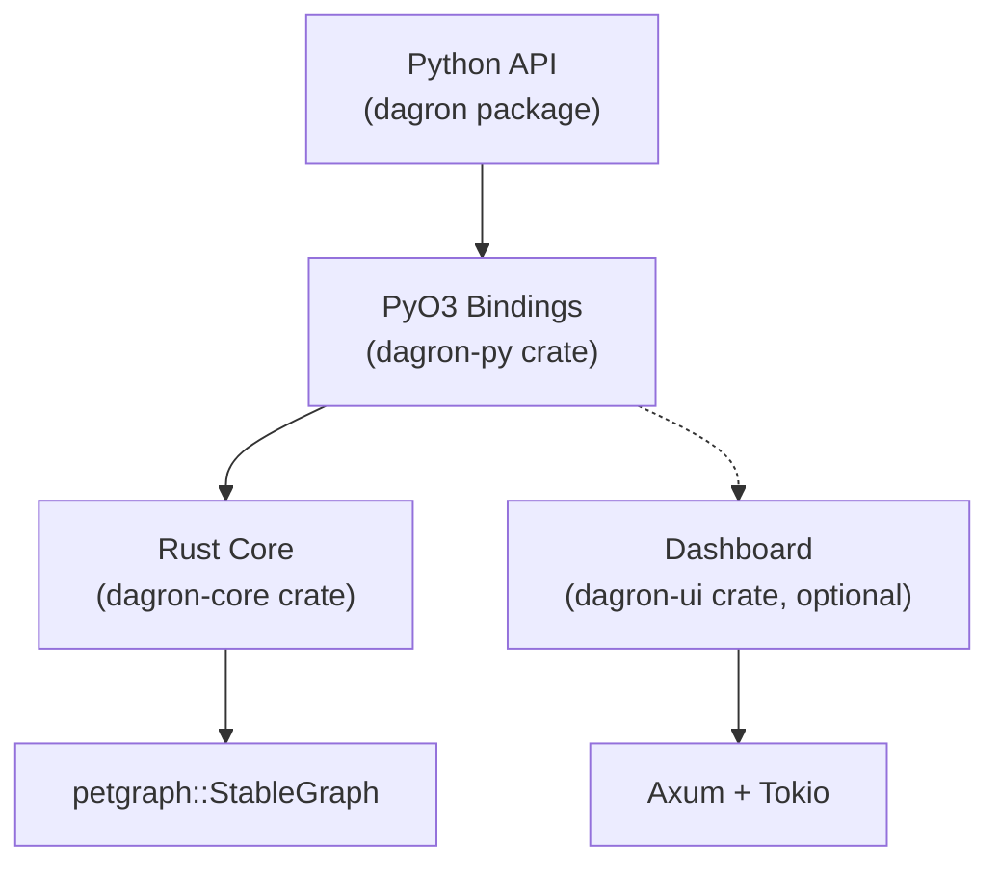
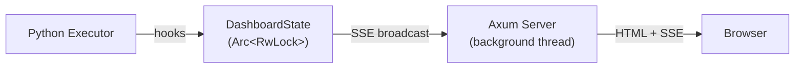

# Architecture

dagron is a layered system: a Rust core providing the graph data structure and algorithms, a PyO3 binding layer that exposes everything to Python, and an optional web dashboard for real-time execution monitoring.



---

## Crate Structure

| Crate | Path | Purpose |
|-------|------|---------|
| `dagron-core` | `crates/dagron-core/` | Graph data structure, algorithms, serialization, scheduling — pure Rust, no Python dependency |
| `dagron-py` | `crates/dagron-py/` | PyO3 bindings wrapping `dagron-core` as a Python extension module |
| `dagron-ui` | `crates/dagron-ui/` | Optional Axum-based web dashboard for live execution visualization |

The Python package (`py_src/dagron/`) adds higher-level execution strategies (incremental, checkpoint, caching, distributed), the builder pattern, analysis utilities, and plugin system — all in pure Python, calling into the Rust core for graph operations.

---

## Rust Core Internals

### DAG\<P\>

The central type is `DAG<P>` in `dagron-core`:

```rust
pub struct DAG<P = ()> {
    graph: StableGraph<NodeData<P>, EdgeData, Directed, u32>,
    name_to_index: AHashMap<String, NodeIndex>,
    generation: u64,
    cache: RwLock<DagCache>,
}
```

- **`graph`** — petgraph's `StableGraph` with arena-allocated node/edge storage. `StableGraph` preserves indices across removals, which is critical for caching correctness.
- **`name_to_index`** — `AHashMap` for O(1) string-to-index lookups. ahash is a fast, non-cryptographic hash map that outperforms the standard `HashMap`.
- **`generation`** — monotonically increasing counter, bumped on every structural mutation (add/remove node/edge).
- **`cache`** — `RwLock<DagCache>` storing cached results for expensive computations.

### Generational Cache

The cache avoids recomputing expensive results (topological sorts, roots, leaves) when the graph hasn't changed:

```rust
struct DagCache {
    gen: u64,        // generation when cache was populated
    hits: u64,
    misses: u64,
    roots: Option<Vec<NodeId>>,
    leaves: Option<Vec<NodeId>>,
    topo_sort: Option<Vec<NodeId>>,
    topo_sort_dfs: Option<Vec<NodeId>>,
    topo_levels: Option<Vec<Vec<NodeId>>>,
}
```

**How it works:**
1. Every mutation to the DAG increments `generation`
2. When a cached result is requested, the cache compares its stored `gen` against the DAG's current `generation`
3. On mismatch, all cached entries are invalidated (set to `None`)
4. On match, the cached result is returned directly

This gives O(1) amortized cost for repeated queries on an unchanged graph.

### Algorithm Modules

| Module | Algorithms |
|--------|-----------|
| `toposort` | Kahn's algorithm, DFS-based sort, topological levels, all orderings |
| `reachability` | Bitset-based reachability index — O(V*E/64) build, O(1) `can_reach` queries |
| `scheduling` | Critical path, bottom-level computation, max-parallelism and resource-constrained plans |
| `partition` | Level-based, size-balanced, and communication-minimizing graph partitioning |
| `paths` | All paths (DFS), shortest path (BFS), longest path |
| `cycle` | Tarjan's SCC for cycle detection, `would_create_cycle` for edge insertion checks |
| `dominators` | Immediate dominators via Cooper-Harvey-Kennedy algorithm |
| `transforms` | Transitive reduction, transitive closure |
| `incremental` | Dirty-set propagation (BFS from changed nodes), change provenance tracking |
| `traversal` | Ancestors, descendants |
| `diff` | Structural graph diffing |

---

## PyO3 Boundary

`dagron-py` wraps `DAG<PyNodePayload>` as `PyDAG`, where `PyNodePayload` holds an `Option<Py<PyAny>>` for arbitrary Python objects as node payloads.

### GIL Release Points

Every CPU-intensive Rust operation releases the Python GIL via `py.allow_threads()`:

- **Topological sort** — all variants (Kahn, DFS, levels)
- **Ancestors / descendants** — graph traversals
- **Reachability** — index building and queries
- **Scheduling** — execution planning, critical path
- **Validation** — cycle detection
- **Serialization** — JSON, bincode, DOT export
- **Transforms** — transitive reduction/closure, dominator tree
- **Partitioning** — all three strategies
- **Pattern matching** — regex/glob node filtering
- **Incremental** — dirty set computation, change provenance
- **Stats** — graph statistics computation

This means Python threads are not blocked while Rust computes. In multi-threaded executors, multiple graph operations can genuinely run in parallel.

### Exception Mapping

Rust errors are mapped to a Python exception hierarchy:

```
DagronError (base)
  +-- CycleError
  +-- NodeNotFoundError
  +-- DuplicateNodeError
  +-- EdgeNotFoundError
  +-- GraphError
```

---

## Dashboard (Optional)

The `dagron-ui` crate provides a live web dashboard for monitoring DAG execution. It is feature-gated and only built when `--features dashboard` is passed to maturin.

### Architecture



1. **Startup:** `DashboardHandle::start(host, port)` spawns a background OS thread running a Tokio runtime with an Axum server
2. **State:** `DashboardState` is shared via `Arc<RwLock<...>>` between the executor and the server thread
3. **Hooks:** The executor calls `node_started()`, `node_finished()`, `execution_finished()` to update state
4. **SSE:** State changes are broadcast to all connected browsers via Server-Sent Events
5. **Endpoints:**
   - `GET /` — single-file HTML/CSS/JS dashboard (embedded at compile time)
   - `GET /api/state` — JSON snapshot of current execution state
   - `GET /api/events` — SSE stream for real-time updates
   - `GET /api/profile` — execution profile statistics
   - `POST /api/gates/{name}/approve` — approve an approval gate
   - `POST /api/gates/{name}/reject` — reject an approval gate

The dashboard requires no external build tools — the entire UI is a single HTML file embedded in the Rust binary.
