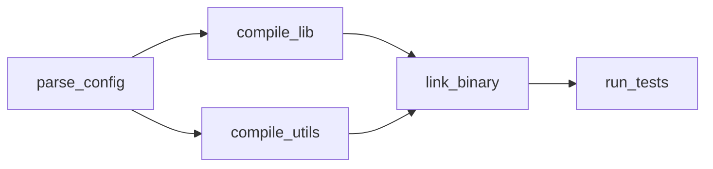
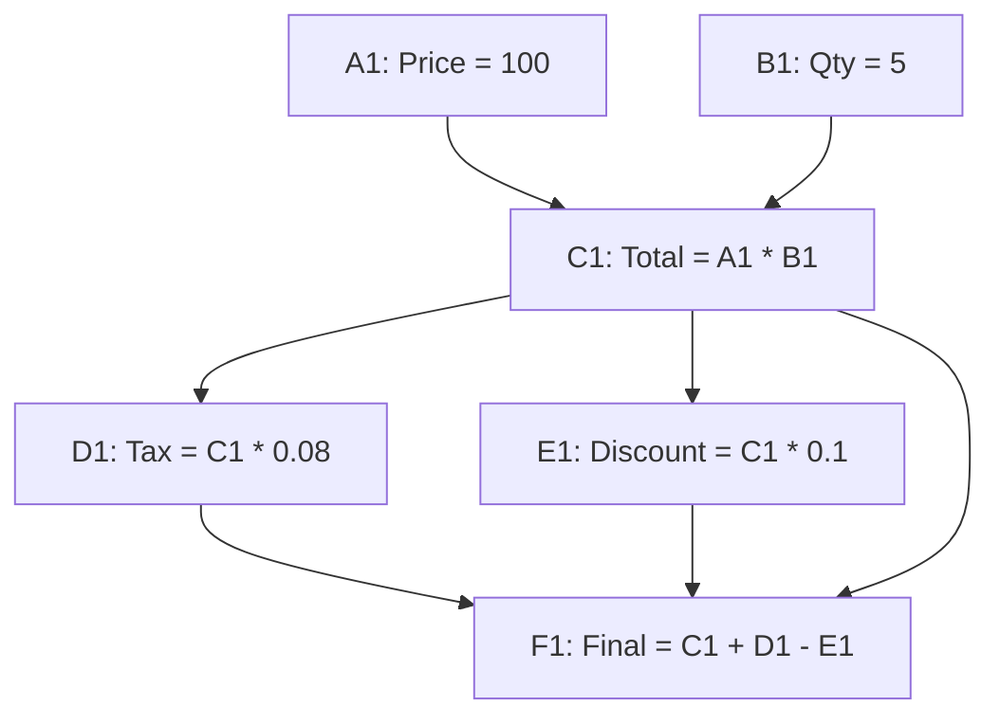
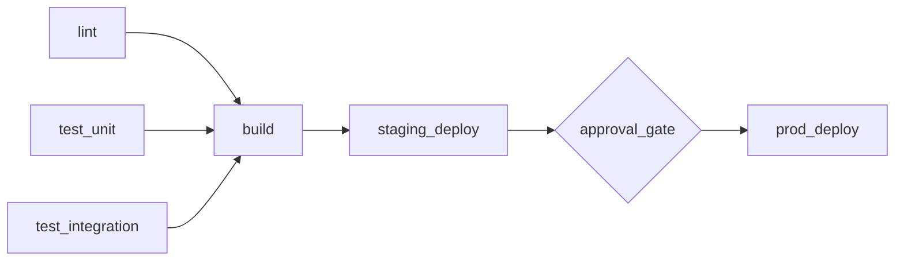

# Cookbook

Four complete examples showing how to use dagron in real-world scenarios. Each includes full code and a DAG diagram.

---

## 1. Build System Dependency Resolver

Model file targets as nodes, detect stale targets via incremental execution, and skip unchanged targets automatically.



```python
import dagron
from dagron.execution import IncrementalExecutor

# Define build targets as a DAG
dag = (
    dagron.DAG.builder()
    .add_node("parse_config", metadata={"output": "config.json"})
    .add_node("compile_lib", metadata={"output": "lib.o"})
    .add_node("compile_utils", metadata={"output": "utils.o"})
    .add_node("link_binary", metadata={"output": "app"})
    .add_node("run_tests", metadata={"output": "test_report.xml"})
    .add_edge("parse_config", "compile_lib")
    .add_edge("parse_config", "compile_utils")
    .add_edge("compile_lib", "link_binary")
    .add_edge("compile_utils", "link_binary")
    .add_edge("link_binary", "run_tests")
    .build()
)

# Simulated build functions
def parse_config():
    print("  Parsing config...")
    return {"version": "1.0", "flags": ["-O2"]}

def compile_lib():
    print("  Compiling lib...")
    return "lib.o"

def compile_utils():
    print("  Compiling utils...")
    return "utils.o"

def link_binary():
    print("  Linking binary...")
    return "app"

def run_tests():
    print("  Running tests...")
    return "PASSED"

tasks = {
    "parse_config": parse_config,
    "compile_lib": compile_lib,
    "compile_utils": compile_utils,
    "link_binary": link_binary,
    "run_tests": run_tests,
}

# First build: runs everything
executor = IncrementalExecutor(dag)
print("=== First build ===")
result = executor.execute(tasks)

# Second build: only re-runs if inputs changed
print("\n=== Incremental rebuild (nothing changed) ===")
result = executor.execute(tasks)

# Mark a node as changed and rebuild
print("\n=== Incremental rebuild (compile_lib changed) ===")
executor.mark_changed("compile_lib")
result = executor.execute(tasks)
```

:::tip What this demonstrates
**Incremental execution** — only changed nodes and their downstream dependents re-execute. The second build is a no-op; the third only re-runs `compile_lib`, `link_binary`, and `run_tests`.
:::

---

## 2. Spreadsheet Formula Engine

Cells are nodes. Formula dependencies are edges. When a cell changes, only dependent cells recalculate.



```python
import dagron
from dagron.execution import IncrementalExecutor

# Build the cell dependency graph
dag = (
    dagron.DAG.builder()
    .add_node("A1")  # Price
    .add_node("B1")  # Quantity
    .add_node("C1")  # Total = A1 * B1
    .add_node("D1")  # Tax = C1 * 0.08
    .add_node("E1")  # Discount = C1 * 0.1
    .add_node("F1")  # Final = C1 + D1 - E1
    .add_edge("A1", "C1")
    .add_edge("B1", "C1")
    .add_edge("C1", "D1")
    .add_edge("C1", "E1")
    .add_edge("C1", "F1")
    .add_edge("D1", "F1")
    .add_edge("E1", "F1")
    .build()
)

# Cell values (mutable state)
cells = {"A1": 100, "B1": 5}

def eval_cell(name):
    """Evaluate a single cell."""
    if name == "A1":
        return cells["A1"]
    elif name == "B1":
        return cells["B1"]
    elif name == "C1":
        cells["C1"] = cells["A1"] * cells["B1"]
        return cells["C1"]
    elif name == "D1":
        cells["D1"] = cells["C1"] * 0.08
        return cells["D1"]
    elif name == "E1":
        cells["E1"] = cells["C1"] * 0.1
        return cells["E1"]
    elif name == "F1":
        cells["F1"] = cells["C1"] + cells["D1"] - cells["E1"]
        return cells["F1"]

tasks = {name: (lambda n=name: eval_cell(n)) for name in dag.nodes()}

# Initial calculation
executor = IncrementalExecutor(dag)
result = executor.execute(tasks)
print(f"Initial: Price={cells['A1']}, Qty={cells['B1']}, Final={cells['F1']}")

# User edits A1 (price) — only C1, D1, E1, F1 recalculate
cells["A1"] = 150
executor.mark_changed("A1")
result = executor.execute(tasks)
print(f"After edit: Price={cells['A1']}, Qty={cells['B1']}, Final={cells['F1']}")
```

:::tip What this demonstrates
**Change propagation** — editing cell A1 triggers recalculation of only the cells that depend on it (C1, D1, E1, F1). B1 is untouched.
:::

---

## 3. ETL Pipeline with Checkpointing

A multi-stage pipeline that writes checkpoints to disk, simulates a crash, and resumes from the last checkpoint.


```python
import dagron
from dagron.execution import CheckpointExecutor

dag = (
    dagron.DAG.builder()
    .add_node("extract")
    .add_node("validate")
    .add_node("transform")
    .add_node("aggregate")
    .add_node("load")
    .add_edge("extract", "validate")
    .add_edge("validate", "transform")
    .add_edge("transform", "aggregate")
    .add_edge("aggregate", "load")
    .build()
)

call_count = {"transform": 0}

def extract():
    print("  Extracting 10,000 rows from source...")
    return list(range(10_000))

def validate():
    print("  Validating schema...")
    return True

def transform():
    call_count["transform"] += 1
    if call_count["transform"] == 1:
        print("  Transforming... CRASH!")
        raise RuntimeError("Simulated crash during transform")
    print("  Transforming data...")
    return "transformed"

def aggregate():
    print("  Aggregating results...")
    return {"total": 10_000, "valid": 9_950}

def load():
    print("  Loading into warehouse...")
    return "success"

tasks = {
    "extract": extract,
    "validate": validate,
    "transform": transform,
    "aggregate": aggregate,
    "load": load,
}

executor = CheckpointExecutor(dag, checkpoint_dir="/tmp/dagron_checkpoints")

# First run: crashes during transform
print("=== Run 1 (will crash) ===")
try:
    result = executor.execute(tasks)
except Exception as e:
    print(f"  Pipeline failed: {e}")

# Second run: resumes from checkpoint, skips extract + validate
print("\n=== Run 2 (resume from checkpoint) ===")
result = executor.execute(tasks)
print(f"  Pipeline completed: {result}")
```

:::tip What this demonstrates
**Checkpointing** — the first run completes `extract` and `validate` before crashing. The second run skips those stages and resumes from `transform`. No wasted work.
:::

---

## 4. CI/CD Task Scheduler

Lint, test, build, and deploy with resource constraints and an approval gate before production deployment.



```python
import dagron
from dagron.execution import ResourceAwareExecutor

dag = (
    dagron.DAG.builder()
    .add_node("lint", metadata={"cpu": 1})
    .add_node("test_unit", metadata={"cpu": 2})
    .add_node("test_integration", metadata={"cpu": 2})
    .add_node("build", metadata={"cpu": 2})
    .add_node("staging_deploy", metadata={"cpu": 1})
    .add_node("approval_gate", metadata={"gate": True})
    .add_node("prod_deploy", metadata={"cpu": 1})
    .add_edge("lint", "build")
    .add_edge("test_unit", "build")
    .add_edge("test_integration", "build")
    .add_edge("build", "staging_deploy")
    .add_edge("staging_deploy", "approval_gate")
    .add_edge("approval_gate", "prod_deploy")
    .build()
)

def lint():
    print("  [1 CPU] Linting...")
    return "ok"

def test_unit():
    print("  [2 CPU] Running unit tests...")
    return "148 passed"

def test_integration():
    print("  [2 CPU] Running integration tests...")
    return "32 passed"

def build():
    print("  [2 CPU] Building Docker image...")
    return "sha256:abc123"

def staging_deploy():
    print("  [1 CPU] Deploying to staging...")
    return "https://staging.example.com"

def approval_gate():
    print("  Approval gate: auto-approved for demo")
    return True

def prod_deploy():
    print("  [1 CPU] Deploying to production...")
    return "https://example.com"

tasks = {
    "lint": lint,
    "test_unit": test_unit,
    "test_integration": test_integration,
    "build": build,
    "staging_deploy": staging_deploy,
    "approval_gate": approval_gate,
    "prod_deploy": prod_deploy,
}

# Execute with a 4-CPU constraint — lint + test_unit run in parallel,
# test_integration waits for a free slot
executor = ResourceAwareExecutor(dag, max_workers=4)
result = executor.execute(tasks)
print(f"\nPipeline result: {result}")
```

:::tip What this demonstrates
**Resource-aware scheduling** — with 4 CPU slots, `lint` (1 CPU) and `test_unit` (2 CPU) run in parallel (3 slots used). `test_integration` (2 CPU) waits until a slot frees up. The approval gate pauses execution until approved.
:::
