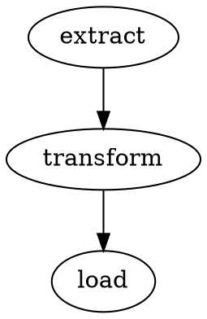
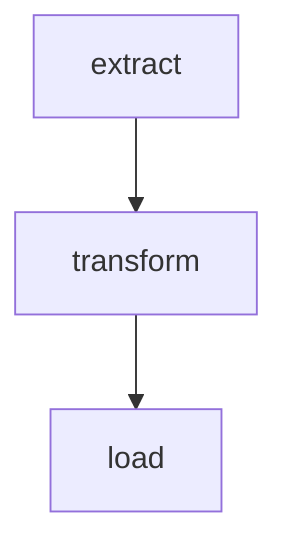

import DagDiagram from '@site/src/components/DagDiagram';
import StatusBadge from '@site/src/components/StatusBadge';

# Serialization

dagron supports multiple serialization formats for persisting DAGs, sharing them
across processes, embedding them in documentation, and visualizing them with
external tools. This guide covers every format and shows how to handle custom
payloads.

## Format comparison

| Format | Round-trip? | Human-readable? | Best for |
|--------|:-----------:|:---------------:|----------|
| JSON | Yes | Yes | Config files, APIs, debugging |
| Binary | Yes | No | Performance-critical storage, IPC |
| DOT | No (export only) | Yes | Graphviz visualization |
| Mermaid | No (export only) | Yes | Documentation, Markdown |
| File (save/load) | Yes | No | Disk persistence with compression |

## JSON serialization

### Export to JSON

```python
import dagron

dag = (
    dagron.DAG.builder()
    .add_edge("extract", "transform")
    .add_edge("transform", "load")
    .build()
)

json_str = dag.to_json()
print(json_str)
```

Output:

```json
{
  "nodes": ["extract", "transform", "load"],
  "edges": [
    ["extract", "transform"],
    ["transform", "load"]
  ]
}
```

### Import from JSON

```python
restored = dagron.DAG.from_json(json_str)

print(restored.node_count())  # 3
print(restored.edge_count())  # 2
print(list(restored.nodes())) # ['extract', 'transform', 'load']
```

The round-trip preserves all structural information: nodes, edges, and their
ordering.

### JSON with payloads

When nodes carry payloads, they are included in the JSON output:

```python
dag = dagron.DAG()
dag.add_node("train", payload={"epochs": 10, "lr": 0.001})
dag.add_node("evaluate", payload={"metrics": ["accuracy", "f1"]})
dag.add_edge("train", "evaluate")

json_str = dag.to_json()
print(json_str)
```

```json
{
  "nodes": [
    {"name": "train", "payload": {"epochs": 10, "lr": 0.001}},
    {"name": "evaluate", "payload": {"metrics": ["accuracy", "f1"]}}
  ],
  "edges": [
    ["train", "evaluate"]
  ]
}
```

### Storing JSON to a file

```python
import json

# Write
with open("pipeline.json", "w") as f:
    f.write(dag.to_json())

# Read
with open("pipeline.json", "r") as f:
    dag = dagron.DAG.from_json(f.read())
```

### Use case: sharing DAG definitions via APIs

```python
from flask import Flask, jsonify, request

app = Flask(__name__)

@app.route("/pipeline", methods=["GET"])
def get_pipeline():
    return dag.to_json(), 200, {"Content-Type": "application/json"}

@app.route("/pipeline", methods=["POST"])
def set_pipeline():
    new_dag = dagron.DAG.from_json(request.data.decode())
    # ... use new_dag ...
    return jsonify({"nodes": new_dag.node_count()})
```

## Binary serialization

Binary format uses an efficient Rust-native encoding that is significantly faster
and more compact than JSON. Use it when performance matters.

### Export to bytes

```python
data = dag.to_bytes()
print(type(data))  # <class 'bytes'>
print(len(data))   # compact binary representation
```

### Import from bytes

```python
restored = dagron.DAG.from_bytes(data)
print(restored.node_count())  # same as original
```

### Use case: Redis caching

```python
import redis

r = redis.Redis()

# Store
r.set("pipeline:etl", dag.to_bytes())

# Retrieve
data = r.get("pipeline:etl")
if data:
    dag = dagron.DAG.from_bytes(data)
```

### Use case: inter-process communication

```python
import multiprocessing as mp

def worker(dag_bytes):
    dag = dagron.DAG.from_bytes(dag_bytes)
    print(f"Worker received DAG with {dag.node_count()} nodes")

# Send the DAG to a subprocess
p = mp.Process(target=worker, args=(dag.to_bytes(),))
p.start()
p.join()
```

### Performance comparison

Binary serialization is typically 5-10x faster than JSON and produces 3-5x
smaller output, because it avoids string parsing and uses Rust's native
serialization:

```python
import time

# JSON
start = time.perf_counter()
for _ in range(10000):
    dagron.DAG.from_json(dag.to_json())
json_time = time.perf_counter() - start

# Binary
start = time.perf_counter()
for _ in range(10000):
    dagron.DAG.from_bytes(dag.to_bytes())
binary_time = time.perf_counter() - start

print(f"JSON:   {json_time:.3f}s")
print(f"Binary: {binary_time:.3f}s")
print(f"Speedup: {json_time / binary_time:.1f}x")
```

## File persistence (save / load)

The `save()` and `load()` methods write and read DAGs to/from disk files. They
use the binary format internally with optional compression.

### Saving to disk

```python
dag.save("pipeline.dagron")
```

### Loading from disk

```python
dag = dagron.DAG.load("pipeline.dagron")
print(dag.node_count())
```

### Use case: checkpoint-style persistence

```python
import os

PIPELINE_PATH = "/var/data/pipeline.dagron"

def get_or_create_pipeline():
    if os.path.exists(PIPELINE_PATH):
        return dagron.DAG.load(PIPELINE_PATH)

    dag = (
        dagron.DAG.builder()
        .add_edge("extract", "transform")
        .add_edge("transform", "load")
        .build()
    )
    dag.save(PIPELINE_PATH)
    return dag
```

## DOT export (Graphviz)

The [DOT language](https://graphviz.org/doc/info/lang.html) is the standard
input format for Graphviz.

```python
dot = dag.to_dot()
print(dot)
```

Output:



### Rendering with Graphviz

```python
import subprocess

dot = dag.to_dot()
with open("pipeline.dot", "w") as f:
    f.write(dot)

subprocess.run(["dot", "-Tpng", "pipeline.dot", "-o", "pipeline.png"])
```

### Rendering in a Jupyter notebook

```python
from IPython.display import SVG, display
import subprocess

dot = dag.to_dot()
result = subprocess.run(
    ["dot", "-Tsvg"],
    input=dot.encode(),
    capture_output=True,
)
display(SVG(result.stdout))
```

## Mermaid export

[Mermaid](https://mermaid.js.org/) is a Markdown-friendly diagramming language
supported by GitHub, GitLab, Docusaurus, and many other platforms.

```python
mermaid = dag.to_mermaid()
print(mermaid)
```

Output:

```
graph TD
    extract --> transform
    transform --> load
```

### Embedding in Markdown

````markdown

````

### Use case: auto-generated documentation

````python
def generate_pipeline_docs(dag, output_path):
    """Generate a Markdown file with an embedded DAG diagram."""
    mermaid = dag.to_mermaid()
    content = f"""# Pipeline Overview

## DAG Structure

```mermaid
{mermaid}
```

## Statistics

- Nodes: {dag.node_count()}
- Edges: {dag.edge_count()}
- Roots: {', '.join(dag.roots())}
- Leaves: {', '.join(dag.leaves())}
"""
    with open(output_path, "w") as f:
        f.write(content)

generate_pipeline_docs(dag, "pipeline.md")
````

<DagDiagram
  chart={`graph TD
    extract --> transform --> load`}
  caption="The same DAG rendered as a DagDiagram component."
/>

## Custom payload serializers

By default, dagron serializes payloads using Python's standard JSON encoder,
which handles `dict`, `list`, `str`, `int`, `float`, `bool`, and `None`. For
custom objects, you need to provide serializer functions.

### Example: serializing dataclass payloads

```python
import dagron
import json
from dataclasses import dataclass, asdict

@dataclass
class TaskConfig:
    retries: int
    timeout_seconds: float
    tags: list

# Build a DAG with dataclass payloads
dag = dagron.DAG()
dag.add_node("fetch", payload=TaskConfig(retries=3, timeout_seconds=30.0, tags=["io"]))
dag.add_node("process", payload=TaskConfig(retries=1, timeout_seconds=120.0, tags=["cpu"]))
dag.add_edge("fetch", "process")

# Custom encoder
class ConfigEncoder(json.JSONEncoder):
    def default(self, obj):
        if isinstance(obj, TaskConfig):
            return {"__type__": "TaskConfig", **asdict(obj)}
        return super().default(obj)

# Custom decoder
def config_decoder(dct):
    if dct.get("__type__") == "TaskConfig":
        return TaskConfig(
            retries=dct["retries"],
            timeout_seconds=dct["timeout_seconds"],
            tags=dct["tags"],
        )
    return dct

# Serialize with custom encoder
json_str = dag.to_json(cls=ConfigEncoder)
print(json_str)

# Deserialize with custom decoder
restored = dagron.DAG.from_json(json_str, object_hook=config_decoder)
```

### Example: binary serialization with pickle payloads

For the binary format, payloads are serialized using pickle by default, so
custom objects work out of the box as long as they are picklable:

```python
import dagron
import numpy as np

dag = dagron.DAG()
dag.add_node("matrix", payload=np.array([[1, 2], [3, 4]]))
dag.add_node("result")
dag.add_edge("matrix", "result")

# Binary round-trip preserves numpy arrays
data = dag.to_bytes()
restored = dagron.DAG.from_bytes(data)
```

## Combining serialization with snapshots

Snapshots and serialization work well together for versioning:

```python
import dagron
from datetime import datetime

dag = (
    dagron.DAG.builder()
    .add_edge("a", "b")
    .add_edge("b", "c")
    .build()
)

# Save version 1
dag.save(f"pipeline_v1.dagron")

# Make changes
dag.add_node("d")
dag.add_edge("c", "d")

# Save version 2
dag.save(f"pipeline_v2.dagron")

# Compare versions
v1 = dagron.DAG.load("pipeline_v1.dagron")
v2 = dagron.DAG.load("pipeline_v2.dagron")

print(f"v1: {v1.node_count()} nodes, {v1.edge_count()} edges")
print(f"v2: {v2.node_count()} nodes, {v2.edge_count()} edges")
```

## Format selection guide

Use this decision tree to pick the right format:

1. **Need to read/write from Python?** Use `save()` / `load()` for files, or
   `to_bytes()` / `from_bytes()` for in-memory.

2. **Need human-readable config?** Use `to_json()` / `from_json()`.

3. **Need to visualize with Graphviz?** Use `to_dot()`.

4. **Need to embed in Markdown/docs?** Use `to_mermaid()`.

5. **Need maximum performance?** Use `to_bytes()` / `from_bytes()`.

## API reference

| Method | Docs |
|--------|------|
| `dag.to_json()` | [DAG](/api/core/core) |
| `DAG.from_json()` | [DAG](/api/core/core) |
| `dag.to_bytes()` | [DAG](/api/core/core) |
| `DAG.from_bytes()` | [DAG](/api/core/core) |
| `dag.save()` | [DAG](/api/core/core) |
| `DAG.load()` | [DAG](/api/core/core) |
| `dag.to_dot()` | [DAG](/api/core/core) |
| `dag.to_mermaid()` | [DAG](/api/core/core) |

## Next steps

- [Incremental Execution](/guide/execution-strategies/incremental) — use save/load for caching intermediate state.
- [Checkpointing](/guide/execution-strategies/checkpointing) — persist execution progress to disk.
- [Graph Transforms](/guide/core-concepts/transforms) — create snapshots before applying transforms.
